# Documentación de arquitectura

## Tabla de contenidos

1. [Vista física](#vista-física)
2. [Vista de desarrollo](#vista-de-desarrollo)
3. [Vista de procesos](#vista-de-procesos)
4. [Tareas a realizar](#tareas-a-realizar)
5. [Instrucciones de ejecución](#instrucciones-de-ejecución)

## Vista física

### Planteamiento

A partir de un análisis conjunto de todas las consultas (queries) que debíamos resolver, diseñamos un bosquejo que nos permitió visualizar el flujo de datos desde el ingreso del cliente hasta la obtención del resultado final. Identificamos funciones que se repetían en múltiples consultas —como el filtrado por año (> 2000), por país, o el enrutamiento por ID— y decidimos desacoplarlas como servicios independientes para reutilizarlas. Esto nos permitió no solo reducir el procesamiento redundante, sino también mejorar la eficiencia general del sistema al compartir resultados intermedios entre varias ramas de ejecución. A su vez, estructuramos la lógica de forma modular, de manera que cada función pudiera escalarse fácilmente y ser reutilizada en distintos contextos, manteniendo coherencia y simplicidad en el diseño.

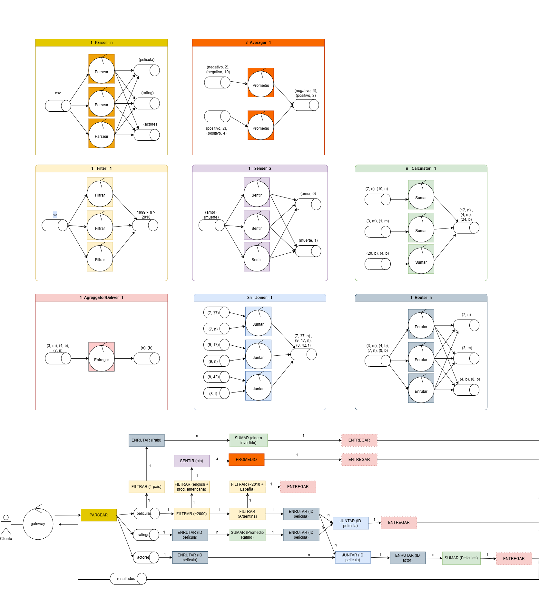

### Diagrama de despliegue

El **diagrama de despliegue** muestra cómo están distribuidos los diferentes componentes del sistema sobre nodos físicos o virtuales. El sistema está diseñado con una arquitectura modular, distribuida y escalable, basada en microservicios.

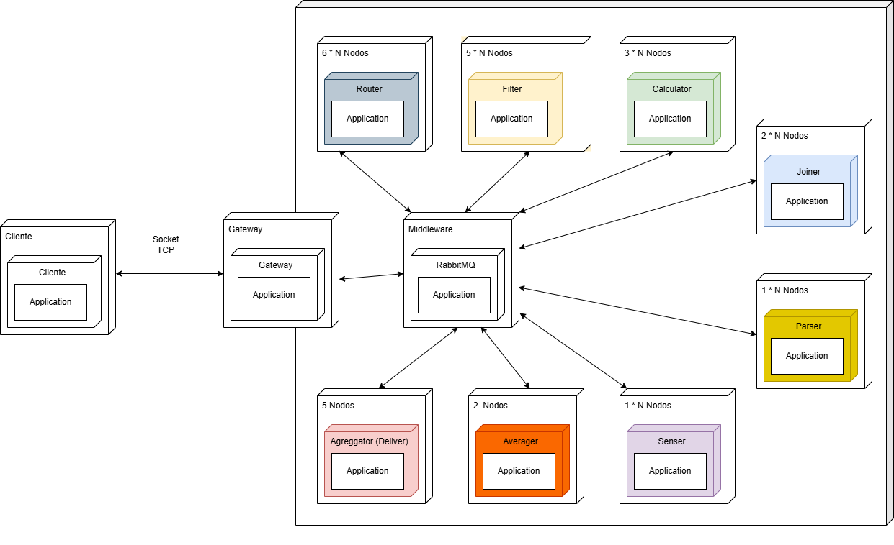

### Flujo General

1. El cliente se conecta al gateway mediante un socket TCP, le envía los archivos y espera por las respuestas.
2. El gateway recibe los archivos del cliente, los envía a una queue y espera por las respuestas para luego enviárselas al cliente.
3. Los parsers leen de la queue del gateway, parsean y distribuyen los registros de los archivos, disparando el pipeline de procesamiento.
4. Una vez procesadas las consultas, los nodos deliver envian los resultados al gateway, quien luego se los envia al cliente.

### Diagrama de robustez

Este diagrama muestra el comportamiento interno del sistema, dividido por responsabilidades y relaciones entre componentes.

En este diagrama indicamos que hay más de una instancia de una entidad utilizando un asterisco (\*).

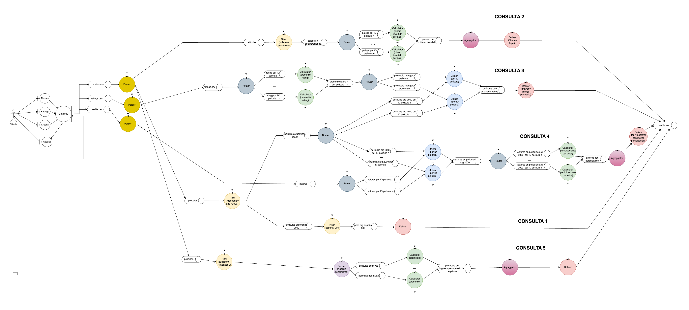

### Componentes Funcionales

#### Gateway

El gateway es el nodo encargado de:

1. Aceptar conexiones entrantes (TCP) de clientes.
2. Recibir los archivos que envía el cliente.
3. Enviar batches de los archivos a a partir de la cual luego se distribuyen entre los distintos nodos.
4. Consumir las respuestas de las consultas a partir de una queue y enviárselas al cliente mediante la conexión TCP.

**Nota:** Los archivos son enviados a colas distintas (una cola por archivo).

#### Parser (escalable - 3 x N nodos)

El parser es el nodo encargado de:

1. Leer los batches de registros que envía el cliente.
2. Transformar/parsear dichos batches a un formato más sencillo de procesar.
3. Disponibilizar estos datos parseados para que los nodos puedan consumirlos.

El parser es agnóstico de cuáles y cuántos nodos consumen sus mensajes, simplemente los envía a un exchange de RabbitMQ con un `routing_key` que determina a qué archivo pertenece el batch.

Además de enviar los datos parseados, también envía mensajes para comunicar que no hay mas batches de un archivo en particular, y para comunicar que el cliente terminó de enviar todos los archivos.

#### Filter (escalable - 5 x N nodos)

El filter es el nodo encargado de filtrar aquellos registros que no forman parte de la respuesta a la query.
Puede leer registros de a uno a la vez como también de a batches, los cuales filtra según una condición que se puede definir mediante la configuración.

#### Router (escalable - 6 x N nodos)

El router se encarga de redireccionar registros de forma tal que los mismos puedan ser procesados de forma más eficiente.
Básicamente:

1. Consume registros de una queue.
2. Redirecciona cada registro a una queue específica según algun valor (en general un ID). Para determinar a qué queue corresponde el registro, se implementa una especie de sharding: el ID de la queue se determina realizando la cuenta `id_registro % cantidad_queues`. Esto nos garantiza que los registros con el mismo ID siempre van a la misma queue.

Esto nos permite realizar operaciones como el join distribuido entre dos tablas (lo cual no sería posible sin el router), o paralelizar cálculos como sumatorias o promedios de una columna dada, para un grupo de registros en particular (por lo general agrupado por ID).

Es importante destacar que el router debe conocer de antemano la cantidad de nodos que van a consumir sus mensajes (el cual es igual a la cantidad de queues).

#### Calculator (escalable - 3 x N nodos)

El calculator lee registros de una input queue, realiza una operacion sobre los registros (como sumatorias, promedios, etc), y envía el resultado a una output queue. Durante el procesamiento, el calculator va acumulando los resultados parciales del cálculo, y los entrega una vez que recibe el mensaje de finalización de archivo.

Para comunicar la finalización del cálculo distribuido a los siguientes nodos, se utiliza el mecanismo detallado en [Mecanismo de finalización](#mecanismo-de-finalización)

#### Joiner (escalable - 2 x N nodos)

El joiner se encarga de recibir registros de dos queues distintas, y juntar aquellos pares de registros que coincidan en alguna columna determinada.

En general los joiners trabajan con datos shardeados y consumen registros de dos queues (por ejemplo, una queue de películas y otra de actores).
Los joiners van consumiendo los registros de cada queue, y una vez que se terminan los registros (lo cual se comunica mediante un mensaje en cada queue), procede a juntarlos. Luego, los resultados finales de distintos joiners van a una misma queue.

Para comunicar la finalización del join distribuido a los siguientes nodos, se utiliza el mecanismo detallado en [Mecanismo de finalización](#mecanismo-de-finalización)

#### Sentiment Analyzer (escalable)

Este es el nodo encargado de leer películas de una input queue, analizar el sentimiento del `overview`, y redireccionar el resultado a una queue según el sentimiento de la película. Internamente utiliza los transformers de Hugging Face.

Al haber múltiples instancias de este nodo, todos consumen de la misma input queue, lo cual nos ahorra tener que sincronizar la finalización.

#### Aggregator (3 nodos)

El aggregator se encarga de consumir los resultados parciales de una consulta y agregarlos para obtener el resultado final.
Hay una única instancia de aggregator por cada consulta. Cada instancia va consumiendo los resultados parciales y los agrega (y envía el resultado final a la siguiente queue) una vez que recibe el mensaje de finalización.

#### Deliver (5 nodos)

El nodo deliver se encarga de leer los resultados del pipeline de procesamiento de cada consulta, ordenarlos, y obtener la respuesta final de la consulta, por ejemplo filtrando algunos registros o eliminando columnas que no forman parte de la respuesta.

Hay una instancia por cada consulta, las cuales deben sincronizarse entre sí para enviar el mensaje de finalización a la queue de respuestas, para que luego el gateway le comunique al cliente el fin de la consulta, según se indica en [Mecanismo de finalización](#mecanismo-de-finalización).

##### Mecanismo de finalización

Varios de los nodos (joiner, calculator) realizan un procesamiento distribuido y envían los resultados parciales a una queue.
Esto requiere cierta sincronización, para que el mensaje de finalización se envíe únicamente cuando todos los nodos entregaron su resultado (y no antes, ya que en ese caso se perdería parte del resultado). Para esto, los nodos comparten una queue de "finalización", de la cual se van desuscribiendo a medida que entregan los resultados parciales. Antes de desuscribirse, cada nodo se fija si es el último nodo suscrito a la queue, y en ese caso envía el mensaje de finalización. Para implementar este mecanismo, cada nodo levanta un thread exclusivo para esto.

**Nota:** en este caso la queue de finalización se usa como un contador de consumidores restantes (más que como queue).

En cuanto a la escalabilidad del ordenamiento de datos, en la primera query no se realiza ningún tipo de ordenamiento, ya que simplemente devolvemos todo lo que se filtra, lo cual no representa un desafío computacional. En la segunda query, el ordenamiento se realiza por país, pero dado que el número de países en el mundo es acotado (alrededor de 195) y no se espera un crecimiento exponencial, tampoco presenta un problema de escalabilidad.

En la tercera query, el nodo join va emitiendo los datos agrupados a medida que los empareja, por lo que el nodo deliver no recibe todos los datos de una sola vez. Solo necesita mantener el valor más alto y el más bajo, lo cual implica una complejidad baja.

Para la quinta query, el nodo aggregator devuelve únicamente dos valores: el promedio de sentimientos positivos y el promedio de negativos. A menos que la cantidad de tipos de sentimientos creciera de manera desproporcionada —lo cual es improbable—, este proceso no representa un cuello de botella en términos de ordenamiento ni de procesamiento.

El único caso que sí podría presentar problemas de escalabilidad es la cuarta query, donde se calcula un top 10 de actores. Si bien con los datasets actuales esto no genera inconvenientes, en un escenario con una gran cantidad de actores el proceso de ordenamiento podría transformarse en un cuello de botella, ya que actualmente no contamos con un nodo dedicado al ordenamiento.

Por razones de tiempo y contexto, decidimos no implementar un nodo específico de ordenamiento. Sin embargo, su desarrollo podría considerarse a futuro para mejorar la escalabilidad del sistema frente a datasets de mayor tamaño.

## Vista de desarrollo

### DAG

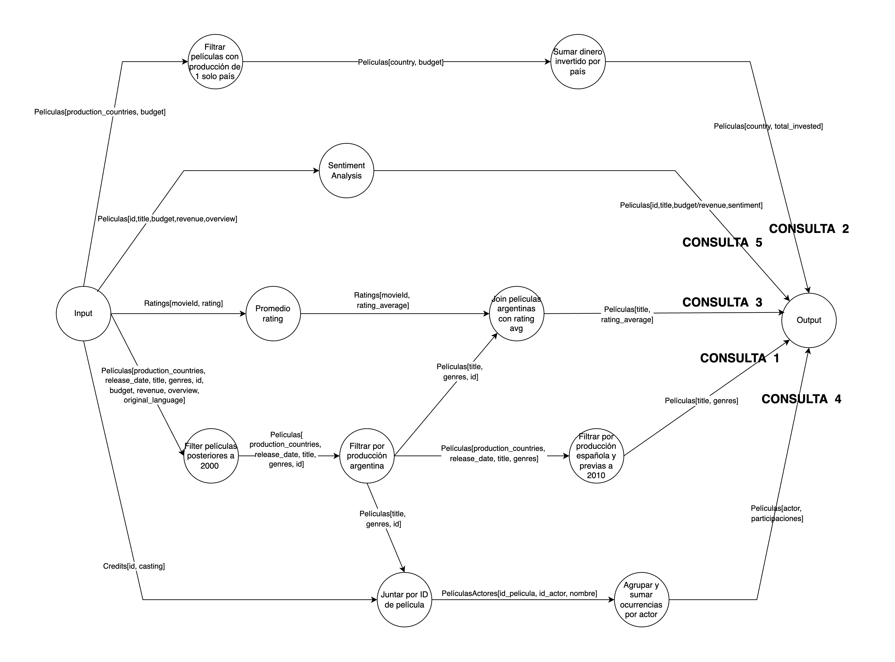

El diagrama muestra como se modifican los datos a lo largo de las consultas, y se puede ver con las columnas de las tablas con las que se van quedando los nodos a la hora de hacer las consultas.

Podemos ver que el filtro de películas posteriores se reutiliza para 3 consultas, en vez de repetirse su cálculo, y a medida que las consultas se van haciendo más específicas, se van requiriendo menos consultas para responderlas.

También podemos ver que para algunas consultas se usan más de una tabla, por lo que se tiene que hacer un join entre dichas tablas, que se ve representado por la operación Juntar, que en ambos casos se hace por el ID de la película.

En todos los casos la data se va transformando hasta llegar al resultado de la query, y todas se envían al data output, que termina de nuevo en el Gateway, que va a ser quien va a enviar las respuestas a las consultas.

#### Estructura General

- Existe una clase base abstracta llamada `Packet`, de la cual heredan todas las clases que representan diferentes tipos de información que circulan por el middleware (Nodo broker).
- El único paquetes que recibe el gateway es el `QueryPacket` como resultado de las querys por parte de alguna cola del middleware.

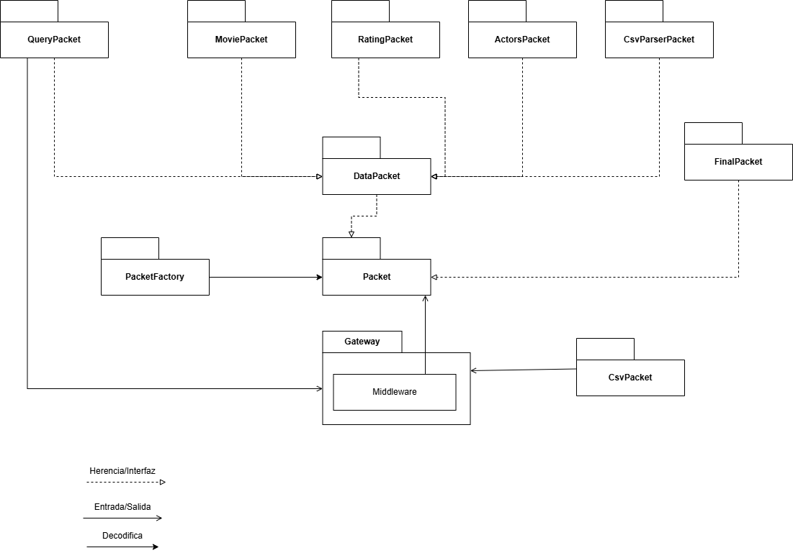

#### Tipos de Packet

- **`FinalPacket`**: Indica el fin de flujo de información dentro de una cola del sistema. Es especialmente útil en sistemas que utilizan colas y procesamiento asincrónico para saber cuándo detener el consumo.
- **`DataPacket`**: Clase intermedia que agrupa múltiples tipos de datos, funcionando como contenedor lógico de información que ya fue interpretada.
- **`QueryPacket`**: Se utiliza para enviar la respuesta final hacia el cliente, conteniendo los resultados solicitados.

#### Flujo de datos

1. El cliente se comunica mediante un socket con el `Gateway`.
2. El `Gateway`, que contiene al `Middleware`, recibe este paquete y lo interpreta, generando una instancia específica de una subclase de `Packet`.
3. Esa instancia se procesa internamente dentro del sistema, generando múltiples transformaciones, que a su vez van generando nuevos paquetes de tipo `DataPacket`.
4. Cada nodo al recibir `FinalPacket` sabe que ya no tiene mas trabajo por hacer y termina.

#### Ventajas del diseño

- **Extensibilidad**: Es sencillo agregar nuevos tipos de `Packet` sin modificar la lógica existente, respetando el principio de abierto/cerrado.
- **Claridad semántica**: Cada clase `Packet` tiene un propósito específico, lo que facilita el mantenimiento y la comprensión del sistema.

## Vista de procesos

### Diagrama de secuencia

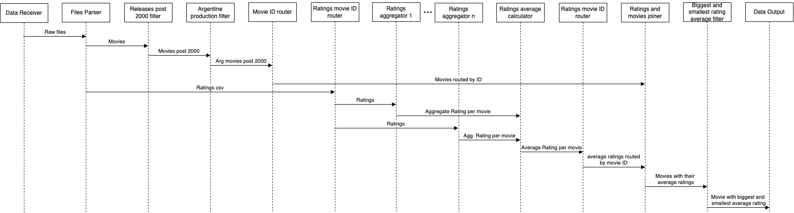

Se eligió mostrar el diagrama de secuencia de la consulta 3, porque en dicha consulta se usan dos tablas, y se terminan uniendo los valores de las mismas.

Se puede ver que el archivo de películas pasa por los filtros correspondientes, y que se calcula el rating promedio para todas las películas, no solo para las que corresponden a los filtros aplicados en la tabla de películas. Esto es así porque consideramos mejor calcular promedios de películas que no vamos a usar que mandar todos los ratings en comunicación, priorizando la reducción de este último.

### Diagramas de actividades

#### Consulta 1

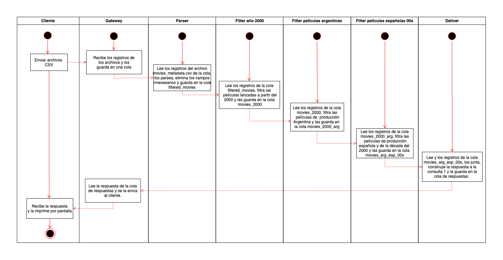

#### Consulta 2

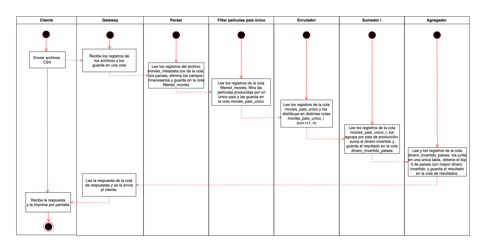

#### Consulta 3

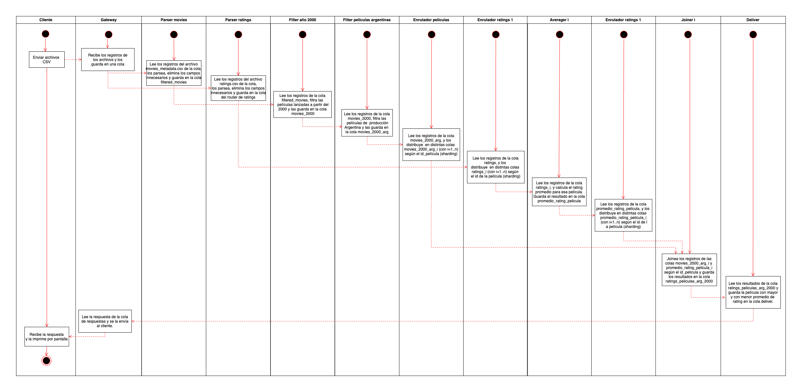

#### Consulta 4

Para resolver esta consulta planteamos una especie de "sharding" de registros, para poder realizar el JOIN de películas y actores de forma distribuida. Esto sucede en los enrutadores de actores y películas. Cada componente se encarga de "mandar" cada registro a su cola correspondiente.

Este "sharding" nos asegura que los actores y películas que comparten `id_pelicula` (la joining key) van a terminar guardados en la misma cola (en realidad son colas distintas pero tienen el mismo id).

Para implementar el sharding de registros en los enrutadores de películas y de actores, se podría hashear el `id_pelicula` de los registros, y calcular el módulo `hash(id_pelicula) % n` (siendo `n` la cantidad de nodos) para determinar el id de la cola en la cual hay que guardar los registros.

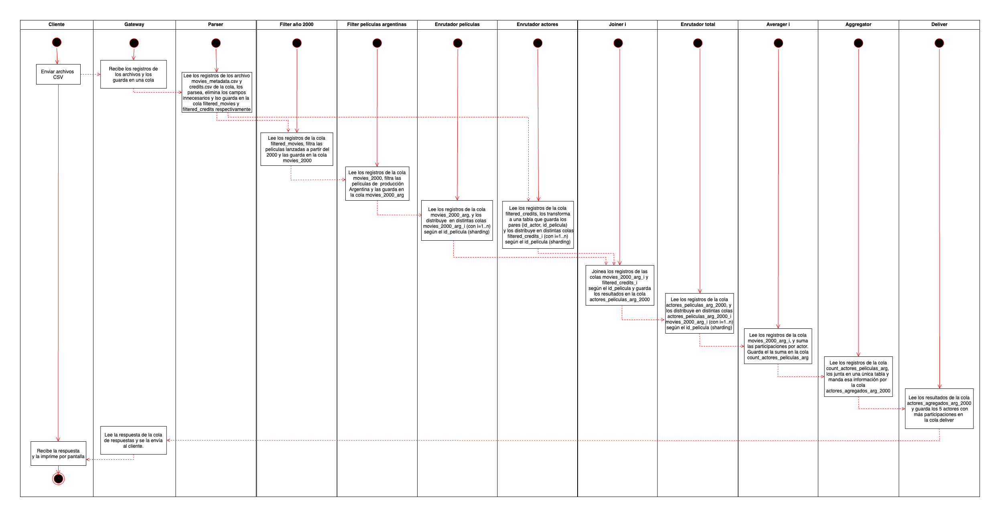

#### Consulta 5

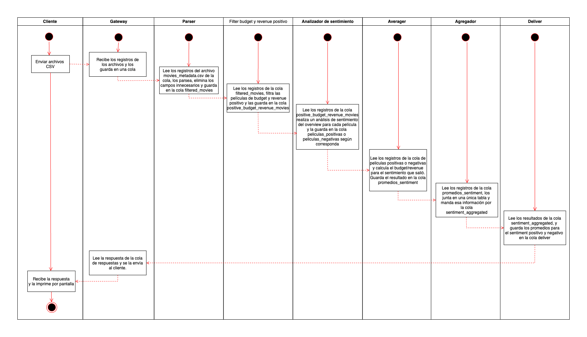

## Tareas a realizar

A continuación se detallan las tareas a realizar para la implementación del sistema:

1. Definir e implementar el protocolo de comunicación.
2. Implementar el cliente (serialización, envío de archivos, recepción de respuestas).
3. Implementar el gateway.
4. Implementar cada uno de los siguientes componentes:
   1. Parser
   2. Router
   3. Filter
   4. Calculator
   5. Joiner
   6. Sentiment analyzer
   7. Aggregator
   8. Deliver
5. Implementar el middleware para la comunicación de grupos utilizando RabbitMQ.
6. Dockerizar cada uno de los componentes del sistema.
7. Implementar Docker compose con los componentes del sistema.
8. Implementar generador de Docker compose parametrizable.

# Entrega 2 - Multiclient

Para soportar ejecuciones de múltiples clientes concurrentemente fue necesario realizar las siguientes modificaciones en los distintos nodos.

## Modificaciones generales

A continuación se detallan las modificaciones que se aplicaron a todos los nodos.

### Cambios en sistema general

Para optimizar el procesamiento y reducir la carga computacional, se modificó el diagrama de robustez reubicando el cálculo del promedio de ratings después de la operación de join, en lugar de realizarlo previamente. Originalmente, calcular los promedios antes del join generaba resultados intermedios innecesarios, especialmente a medida que crecía el archivo de ratings, lo que incrementaba la complejidad y el uso de recursos. Al adelantar el join para filtrar y combinar los datos relevantes primero, se eliminan registros no necesarios antes del cálculo, simplificando el proceso y mejorando la eficiencia del sistema.

### Separación de los cálculos operaciones por cliente

Esto implicó asignar un id único e incremental a cada cliente, e incluirlo en cada uno de los mensajes (del lado del servidor) para poder identificar a qué cliente corresponde cada mensaje (campo `client_id`). Esto es crucial para aquellos nodos stateful (aggregator, calculator, joiner) ya que les permite separar los resultados intermedios según el cliente.

### Mecanismos de sincronización de finalización

Previamente este mecanismo estaba implementado utilizando la función `channel.consumers_count()` que ofrece Rabbit, aprovechando que cada nodo se desconectaba al recibir el mensaje de finalización.

Sin embargo este approach no funciona con múltiples clientes, ya que los nodos no se pueden desconectar porque el sistema debe permanecer activo. En este caso se implementaron dos mecanismos, dependiendo de si el nodo consume de su propia queue, o si consume de una working queue:

#### Nodos con queue propia

En este caso, para cada cluster de nodos se tiene un nodo líder (el de id 0), encargado de enviar el mensaje de finalización a la siguiente queue.

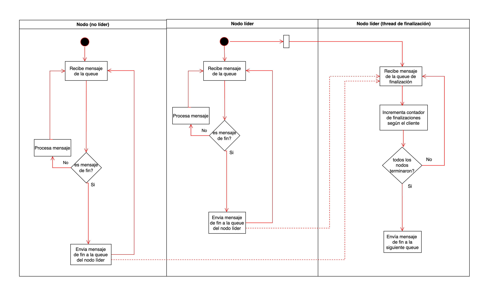

Cuando cada nodo recibe el mensaje de finalización, termina su procesamiento (si es stateful, envía los resultados a la siguiente queue, si es stateless, no hace nada) y luego le envía un mensaje al líder, notificándole que la finalización de su procesamiento. Cuando el líder recibe notificaciones de cada uno de los nodos, envía el mensaje de finalización a la siguiente queue.

#### Nodos con queue compartida

Para este caso extendimos el mensaje de finalización con una lista que contiene los ids de los nodos que terminaron su procesamiento. Cuando un nodo recibe este mensaje, sigue los siguientes pasos:

1. Chequea si su id esta en la lista. Si no está, lo agrega a la lista.
2. Si la lista está completa, envía el mensaje de finalización a la siguiente cola.
3. Si la lista **no** está completa, reencola el mensaje en la cola compartida.

Esto tiene un problema de fairness, ya que el procesamiento de los mensajes de un cliente puede haber terminado, pero el mensaje de finalización tarda en llegar al último nodo. Sin embargo, fuimos por este método porque nos pareció sencillo, y a priori la performance no es una prioridad.

## Modificaciones específicas de cada nodo

A continuación se detallan los cambios que fueron realizados para nodos en específico.

### Gateway

En esta entrega el gateway está constantemente esperando por nuevas conexiones, y lanza un proceso para handlear cada conexión. Cada uno de estos procesos atiende al cliente durante toda la conexión, es decir, recibe los archivos, los envía a los nodos para iniciar el procesamiento, y luego le envía los resultados al cliente.

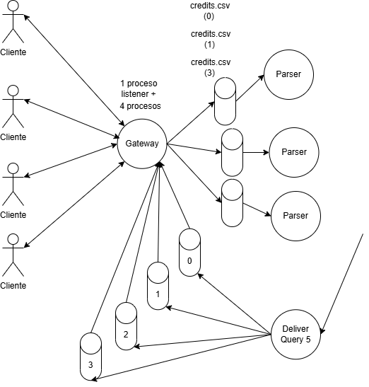

### Joiner

Dado que ahora cada joiner deben procesar los mensajes de múltiples clientes en simultáneo, es claro que la memoria es un factor limitante. Es por esto que se modificó el joiner para que vaya guardando en disco los registros de los clientes, de forma tal que no se quede sin memoria.

El Joiner procesa mensajes de dos colas de RabbitMQ usando dos threads: uno para la cola primaria (movies) y otro para la cola secundaria. Cuando el thread de la cola secundaria recibe un paquete que no puede combinar inmediatamente, lo almacena en disco con StorageHandler. Al recibir un EOF en la cola primaria para un cliente, el thread primario notifica al secundario, que carga todos los datos almacenados en disco para ese cliente, ejecuta el join, y limpia los recursos. Posteriormente, el thread secundario descarta o combina directamente los paquetes de ese cliente sin almacenarlos, hasta que recibe el EOF en la cola secundaria, completando el procesamiento.

### Diagramas de actividades sobre el Joiner

Agregamos diagramas de secuencia que explican el funcionamiento de los dos hilos del joiner que ejecutan la lógica principal.

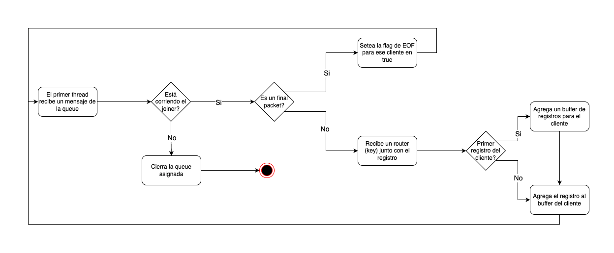

En este diagrama podemos ver como el primer thread siempre está procesando mensajes de la queue, en espera de que la flag que indica el cierre del joiner se active. Mientras no se active, va a seguir recibiendo paquetes, y en caso de recibir un final packet setea la flag de EOF en true, que le va a servir al segundo thread para saber que tiene que juntar los valores que tenga guardados con los que se hayan juntado en el buffer en el que escribe el primer hilo.

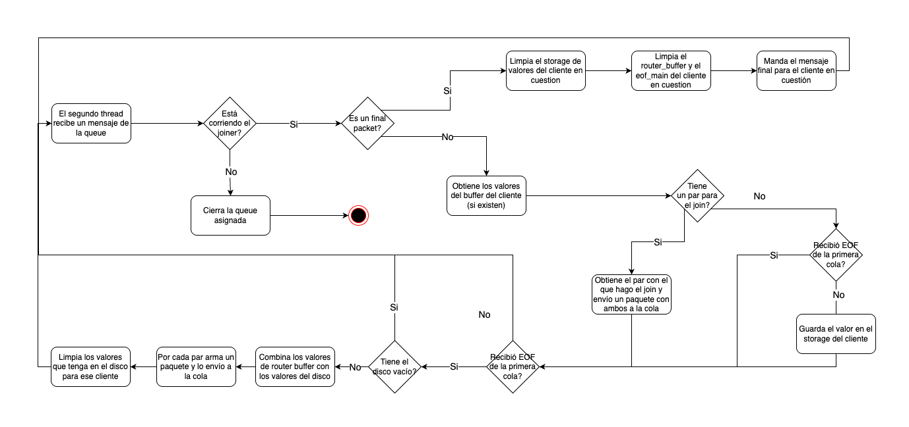

En cuanto al segundo thread, vemos que al igual que el primero, va a leer mensajes de la queue (en este caso la segunda) hasta que le llegue un SIGTERM. Este thread lee registros de queue, en caso de que sea un final packet limpia el storage para ese cliente y manda un final packet a la cola, y si no lo es entonces va a intentar matchear el valor con uno de los que haya recibido el primer thread para el mismo cliente, a través de la routing key. Si no puedo hacerlo y no recibió un EOF entonces lo va a guardar en el storage. Si pudo hacerlo, entonces va a juntar el par y mandar un paquete con dicho par. En caso de encontrarse un EOF entonces va a combinar los valores que tenga en el storage que matcheen con aquellos que están en el buffer del primer thread, y luevo va a limpiar el storage para dicho cliente.

### Problemas enfrentados

#### EOF Adelantado a los paquetes

Durante ciertas ejecuciones de nuestro sistema distribuido, observamos un comportamiento inesperado: el paquete EOF (fin de flujo) de un cliente, que se enviaba al final de su secuencia de datos, se adelantaba en la cola de RabbitMQ a los paquetes de datos (data packets) del mismo cliente. Esto provocaba una pérdida de información, ya que el EOF señalaba el fin del flujo, causando que los paquetes de datos posteriores fueran ignorados.

Inicialmente, sospechamos que el problema podía deberse a una falta de sincronización en el código. Sin embargo, tras un exhaustivo proceso de depuración y múltiples revisiones del código, confirmamos que el envío del EOF se realizaba después de los paquetes de datos mediante llamadas secuenciales al método publish del middleware de RabbitMQ. Este hallazgo nos dejó desconcertados, ya que la lógica de nuestro código garantizaba el orden correcto de publicación (data packets primero, EOF después), pero el orden de procesamiento en la cola no respetaba esta secuencia.

Para entender la causa raíz, investigamos más a fondo el comportamiento de RabbitMQ. Descubrimos que, en escenarios con múltiples conexiones a una misma cola, el orden de procesamiento de los mensajes no siempre coincide con el orden cronológico de publicación. Específicamente, si una conexión envía un mensaje pequeño (como el EOF) y otra conexión envía una serie grande de paquetes de datos, el mensaje pequeño puede ser procesado y colocado en la cola antes que los paquetes más grandes, incluso si se publicó después. En nuestro caso, la conexión encargada de enviar el EOF (que se encuentra en el thread que gestiona la cola del lider) lograba que este mensaje llegara a la cola antes que los paquetes de datos enviados por otras conexiones, a pesar de publicarse posteriormente.

Esta eventualidad nos llevó a explorar soluciones para garantizar el orden correcto de los mensajes en la cola. Durante nuestra investigación, encontramos en la documentación de la biblioteca Pika un mecanismo clave: las confirmaciones de entrega (delivery confirmations). Este mecanismo, descrito en [Pika Blocking Delivery Confirmations](https://pika.readthedocs.io/en/stable/examples/blocking_delivery_confirmations.html), permite que el método publish espere una confirmación del servidor de RabbitMQ antes de considerar que un mensaje ha sido exitosamente ingresado en la cola.

Por lo tanto, implementamos las confirmaciones de entrega en nuestros nodos con uso de cola lider para sincronizar el EOF. Este cambio garantizó que el EOF solo se publicara una vez que todos los paquetes de datos estuvieran confirmados en la cola, respetando así el orden lógico del flujo de datos. La solución no solo resolvió el problema de adelantamiento, sino que también mejoró la robustez del sistema al añadir una capa de confiabilidad en la entrega de mensajes.

## Instrucciones de ejecución

A continuación se indican los diferentes comandos para ejecutar el sistema

> [!NOTE]
>
> Los siguientes comandos utilizan internamente `docker-compose` (no `docker compose`).
> En caso de que alguno de los comandos no funcione, reemplazar en el Makefile cada ocurrencia de `docker-compose` por `docker compose` con el siguiente comando:
>
> ```bash
> sed -i 's/docker-compose /docker compose /g' Makefile
> ```

### Levantar el sistema

Este comando genera el archivo `docker-compose-gen.yaml` leyendo el archivo de configuración `config.ini` y levanta el sistema con dichos parámetros.

```bash
make up
```

En la sección `[FILES]` del archivo `config.ini` se puede especificar el path a los archivos que se van a usar para hacer las consultas.

```ini
[FILES]
MOVIES_FILE = data/movies_metadata.csv
RATINGS_FILE = data/ratings_reduced.csv
CREDITS_FILE = data/credits.csv # Se genera al descomprimir data/credits.rar
```

### Detener el sistema

```bash
make down
```

### Ejecutar tests

El siguiente comando testea el funcionamiento del sistema, contrastándolo contra los resultados del Jupyter notebook.

```bash
make test_against_notebook
```

Ejecuta de los siguientes pasos:

1. Levanta el sistema y lo deja ejecutando en background.
2. Pone a ejecutar el Jupyter notebook en un container de Docker, utilizando como input los archivos declarados en `config.ini`
3. Espera a que los clientes terminen, y compara los resultados de cada cliente contra los resultados del notebook.

# Entrega 3 - Tolerancia a fallas

## Decisiones de diseño

A la hora de diseñar nuestro sistema tuvimos algunos problemas, ante los cuales decidimos tomar ciertas decisiones de diseño, que queremos explicitar en este informe para que no pasen desapercibidas en la entrega.

### Final packets para manejar pérdidas y registro de procesados

Para llevar un control riguroso del flujo de datos y evitar la pérdida de paquetes, implementamos un mecanismo de mensajes final que incluye un campo count, el cual indica cuántos paquetes fueron enviados por el nodo emisor. Esto permite a los nodos receptores saber exactamente cuántos paquetes deben recibir antes de considerar completo el procesamiento de una solicitud.

Este contador se ajusta dinámicamente en cada etapa del procesamiento. Por ejemplo, un nodo parser puede generar múltiples paquetes a partir de uno solo, por lo que incrementa el count. En cambio, un filter puede descartar algunos paquetes y reducir el total, y un router puede dividir los paquetes en múltiples rutas, cada una con su propio sub-conteo.

La motivación detrás de este diseño fue evitar situaciones en las que un paquete se pierde por la caída de un nodo: si el mensaje final se procesa antes que el paquete retrasado o perdido, ese paquete se vuelve inútil y no es procesado. En cambio, si se conoce de antemano la cantidad esperada, los nodos pueden esperar a que todos lleguen, incluso si hay reintentos involucrados.

Este enfoque, sin embargo, trajo desafíos en los nodos con colas compartidas y diseño stateless. En estos casos, múltiples instancias pueden procesar indistintamente paquetes de la misma cola. Esto genera un problema: si un paquete se reencola por una falla y es procesado por otra instancia, el count podría duplicarse erróneamente. Para resolver esto, introdujimos un nodo de control con estado persistente del que hablaremos mas adelante.

Una duda razonable que podría surgir con este enfoque es la posibilidad de que, ante una falla, se pierda un paquete y simultáneamente se procese otro duplicado. En ese caso, el conteo total de paquetes recibidos coincidiría con el indicado en el final, y el error pasaría inadvertido. Sin embargo, este escenario está contemplado y prevenido: cada nodo lleva un registro de los paquetes que ya ha procesado, basándose en un identificador único incluido en cada uno. Si un paquete recibido tiene el mismo ID que otro previamente procesado, se lo considera duplicado y se descarta automáticamente. Gracias a este mecanismo, aseguramos que el conteo refleje únicamente paquetes válidos y únicos, garantizando así la integridad del procesamiento incluso ante reintentos o fallos parciales.

### Actualización del diagrama de robustez

Ante la separación entre nodos stateful y stateless, tomamos la decisión de adaptar la arquitectura para respetar las responsabilidades y comportamientos de cada tipo:

1. Los nodos stateful, que requieren persistencia, no comparten colas y bajan la información a disco.
2. Los nodos stateless, en cambio, trabajan sobre colas compartidas y se sincronizan únicamente con el nodo de control, sin almacenar estado local.

En ese contexto, el nodo Calculator de la query 5, que originalmente operaba sobre una cola compartida, debía ajustarse a su rol de stateful, ya que necesita persistir sus resultados en disco.

Por eso, rediseñamos su entrada y colocamos dos routers independientes, uno para películas positivas y otro para negativas. Cada uno direcciona a su propia cola separada y dedicada, antes de llegar al calculator.

De esta forma, logramos desacoplar completamente los nodos stateful de los stateless, garantizando un diseño coherente y mantenible.

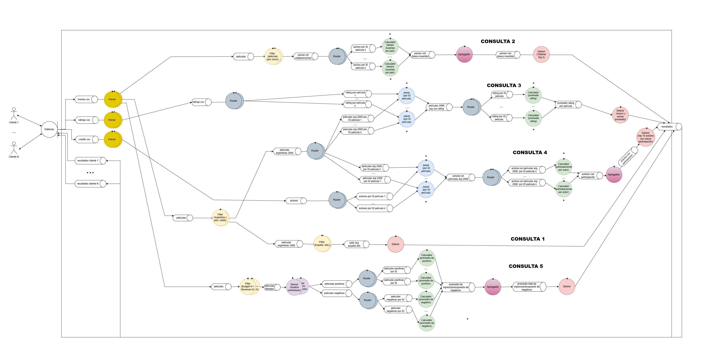

### Persistencia de los datos en los nodos join

En la entrega anterior ya estabamos persistiendo en un storage para cada cliente los paquetes que llegaban a la queue del `join_callback` pero no tenían un match con alguno de los paquetes de la queue del `main_callback`. En estos casos dicho paquete se guardaba en un storage hasta que se hayan recibido los EOF para ambas colas, momento en el cual se buscaban matches entre los paquetes en el router_buffer (los que estaban en memoria, de la queue del `main_callback`) y los que se habían guardado en el storage.

Para esta entrega, con el fin de hacer que el nodo join sea más tolerante a fallos, decidimos persistir en disco los paquetes recibidos de la queue del `main_callback`, además de guardarnos también en memoria la flag eof_main (que indica si se recibión un EOF en la queue del main callback), una lista de los mensajes procesados en la main queue, otra lista para los paquetes procesados de la join queue y otra para los paquetes publicados en la cola del output.

Esa información se guarda como checkpoint cada vez que cambia el estado del nodo, como puede ser que cambie la flag eof_main, que se procese un paquete en alguna de las dos colas de input de paquetes, o que se guarde en el router buffer o en el storage algún paquete.
Podemos ver que este checkpoint del estado se suele hacer justo antes de enviar el ACK para el paquete recibido de alguna de las dos colas, para intentar minimizar el daño de una falla en el nodo que nos haga perder el estado.

La escritura del estado en disco se hace a través de la función `atomic_write`, implementada por nosotros. La idea de la misma es escribir el estado en un archivo temporal, y una vez que termina el proceso de escritura, se renombra el archivo anterior por el temporal. Guardamos el estado de esta forma porque, en caso de haber una falla durante la escritura en el archivo temporal, la versión anterior se preserva sin problemas. Como adicional, la operación de replace se hace de forma atómica, por lo que no tendremos problemas ante caídas durante esa operación (dado que se hace o no se hace, no hay punto medio).

### Tolerancia a fallos en el resto de nodos stateful

Para que el resto de nodos stateful (`calculator`, `aggregator`, `deliver`) sean tolerantes a fallas, es necesario persistir su estado, al igual que en el join, para que pueda ser recuperado ante caídas.
Entre el estado que se guarda se encuentra
* Los IDs de los paquetes que fueron procesados: Esto es necesario para detectar duplicados y poder ignorarlos, para que el resultado final sea correcto. Por ejemplo, el resultado de un promedio puede dar distinto si tiene un valor repetido.
* Estado que resulta de procesar mensajes. Por ejemplo, para el caso del `calculator` estos serían los resultados que luego envía al `aggregator`, etc.

Al igual que en el nodo join, esta persistencia se realiza de forma atómica.

Con la persistencia del estado y el trackeo de duplicados podemos asegurarnos que los nodos stateful se comportan según lo esperado, incluso ante caídas. Algo que puede suceder es que manden mensajes repetidos, sin embargo el nodo que consuma esos mensajes va a encargarse de trackear los duplicados, por lo tanto esto **no** es un problema.

> [!NOTE]  
> En [este documento](./docs/tolerancia_fallas_nodos_stateful.md) se ilustra con diagramas varios casos de falla en los nodos stateful, y cómo los toleran.

Los nodos stateful se coordinan mediante un líder para enviar el paquete FINAL (Ver [Mecanismos de sincronización de finalización - Nodos con queue propia](#nodos-con-queue-propia)).
Para tolerar fallas en estos casos, el nodo líder persiste los mensajes recibidos, tanto para evitar perder la cuenta de cuáles nodos enviaron el FINAL, como para detectar duplicados. Esto nos garantiza que el FINAL definitivo se va a enviar solamente cuando todos los nodos enviaron su FINAL, ni antes ni después.

### Los nodos control para garantizar alta disponibilidad

La forma de garantizar que los nodos del sistema tengan una alta disponibilidad fue la implementación de nodos de control, que se dediquen a controlar que los nodos de la lógica de negocio estén activos, además de controlarse entre sí en forma de anillo. Esto último significa que el nodo de control 1 se comunica con el 2, el 2 con el 3, y así hasta llegar al último, que se comunica con el primero, completando el anillo.

La idea es que cada nodo de control tiene un hilo que se encarga de escuchar la conexión de health-check del anterior, en la que simplemente acepta la conexión y la cierra, y otro hilo que realiza health-check del nodo siguiente, que se conecta con el nodo mediante TCP y luego cierra dicha conexión.

Cada nodo de control también realiza health-checks periódicos a los hilos worker de los nodos de la lógica de negocio, asegurando que estén activos y funcionando correctamente. Esta supervisión constante permite detectar fallas tempranas y mantener la integridad del sistema.

Además de monitorear la disponibilidad de los nodos de negocio, los nodos de control también gestionan las solicitudes que provienen de los hilos worker.

En cuanto a la arquitectura, los nodos stateless cuentan con un nodo de control dedicado exclusivamente a ellos, encargado de coordinar el envío de los finals y calcular sus conteos necesarios. Por otro lado, los nodos stateful son supervisados por un único nodo de control, dado que la mayoría de sus hilos solo realizan health-checks. La excepción es el gateway, que dispone de un nodo de control separado para facilitar la elección de líder y permitir una recuperación rápida de gateways de respaldo.

Existen tres tipos de request:

- Insert id: Inserta el ID y el send del paquete recibido en disco, almacenando esta información en un archivo específico para el cliente correspondiente. Luego de la inserción, si se detecta que ya se recibió un paquete final, se calcula la cantidad de IDs únicos almacenados en dicho archivo. En caso de que esta cantidad coincida con el conteo final esperado para ese cliente, la función devuelve true junto con el valor del nuevo count final, indicando que se han procesado todos los paquetes correspondientes a ese nodo.

- Delete client: Elimina toda la información persistida asociada a un cliente específico, ya sea porque se completó el procesamiento de sus paquetes o porque el cliente se desconectó. Además, registra al cliente en una lista de clientes muertos para seguimiento.

- Receive final count: Recibe la información acerca de la cantidad total de paquetes que deberían procesarse para un cliente, extraída del paquete final. A continuación, calcula el número de IDs únicos almacenados en el archivo correspondiente. Si este número alcanza el conteo final esperado para el cliente, la función devuelve true junto con el valor del nuevo count final, señalando que el procesamiento de todos los paquetes para ese nodo ha finalizado.

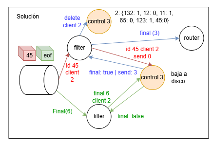

En este ejemplo, un paquete llega después de que se recibió el paquete final. Al recibir el paquete final, el filtro lo guarda en disco y verifica si se cumple el conteo esperado de 6 IDs. Al observar que solo tiene 5 IDs almacenados, determina que el conteo aún no se ha completado y devuelve final=false.

Cuando finalmente llega ese paquete pendiente, el filtro lo procesa y lo envía al nodo de control, que también lo guarda en disco. Ahora, con el paquete final ya activado, el nodo de control verifica que se hayan recibido los 6 IDs esperados. Como la condición se cumple, envía final=true y send=3, indicando que de los 6 paquetes, solo 3 fueron filtrados hacia el siguiente nodo router.

Luego, el filtro envía el paquete final con count=3 y, finalmente, solicita al nodo que elimine toda la información persistida en disco correspondiente al cliente 2.

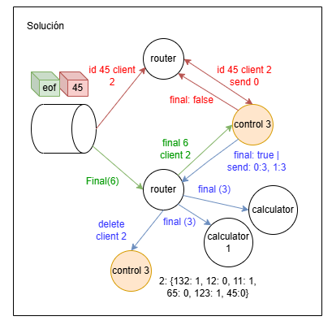

En este ejemplo, un paquete llega al nodo router, que lo enruta hacia el nodo calculator (nodo 0). A su vez, el router notifica al nodo de control, enviándole la información con send=0. El nodo de control persiste este dato en disco y devuelve final=false, ya que aún no ha recibido el paquete final.

Cuando finalmente llega el paquete final, el nodo de control revisa si la cantidad de IDs únicos almacenados en disco coincide con el final count esperado. Al cumplirse esta condición, responde con final=true y la información del reparto (send), que indica cuántos paquetes se enviaron a cada ruta. En este caso, fueron 3 a calculator y 3 a calculator_1.

Una vez que el router recibe esta respuesta, envía los paquetes finales correspondientes a cada nodo destino. Finalmente, le indica al nodo de control que elimine del disco toda la información relacionada con ese cliente, completando así el ciclo de procesamiento.

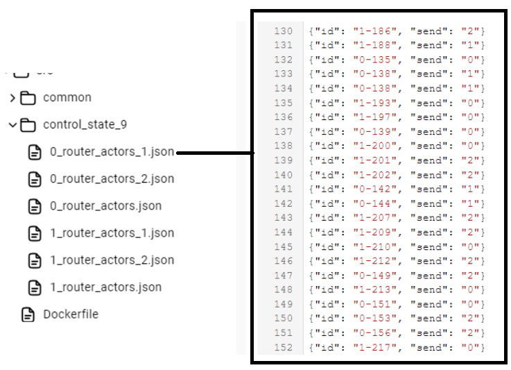

Por motivos de performance, cada nodo y cliente cuenta con su propio archivo de almacenamiento. Esto permite que múltiples nodos escriban paquetes del mismo cliente en paralelo, sin necesidad de competir por acceso a un único archivo compartido. De esta manera, se maximiza la concurrencia y se evita el bloqueo entre nodos durante la escritura.

Cuando se detecta la llegada de un paquete final —o si este ya fue recibido previamente—, el nodo de control adquiere los locks de todos los archivos asociados a ese cliente antes de proceder a leerlos. Esto garantiza la exclusión mutua durante el conteo de IDs únicos y evita condiciones de carrera.

Cabe destacar que el nodo de control no filtra paquetes duplicados al momento de guardarlos en disco, ya que la prioridad está puesta en la velocidad de escritura. Los duplicados se filtran únicamente al momento de hacer el conteo, aceptando así un mayor uso de disco en favor de un procesamiento más eficiente ante cargas altas o escenarios concurrentes.

En conclusión, los nodos de control no solo se encargan de monitorear y mantener activos los nodos de la lógica de negocio, sino que también cumplen un rol clave en la coordinación del procesamiento final entre los nodos stateless, es decir, aquellos que comparten una misma cola y no persisten información en disco. En estos casos, el nodo de control es responsable de llevar el seguimiento del conteo y asegurar que se cumpla el envío del final únicamente cuando todos los paquetes correspondientes hayan sido procesados correctamente, garantizando así la integridad del flujo de datos.

### Nuevo Diagrama de despliegue

En el diagrama de despliegue se incorporaron los nodos de control. Aquellos conectados entre sí mediante flechas de doble sentido representan los nodos encargados de coordinar la finalización de los nodos stateless, que por su propia naturaleza no pueden determinar cuándo deben finalizar. El resto de los nodos de control se encargan exclusivamente de supervisar el estado de los nodos stateful, monitoreando su disponibilidad y correcto funcionamiento.

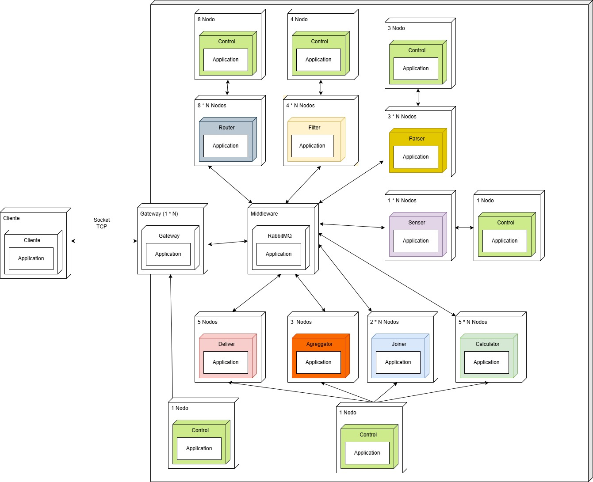

Esta configuración genera un anillo de 18 nodos de control alrededor del sistema, lo que permite implementar mecanismos distribuidos de detección y recuperación ante fallos. De esta forma, el sistema se vuelve tolerante a fallos, ya que siempre hay nodos de control monitoreando el estado del sistema y coordinando su correcto cierre y reinicio en caso de ser necesario.

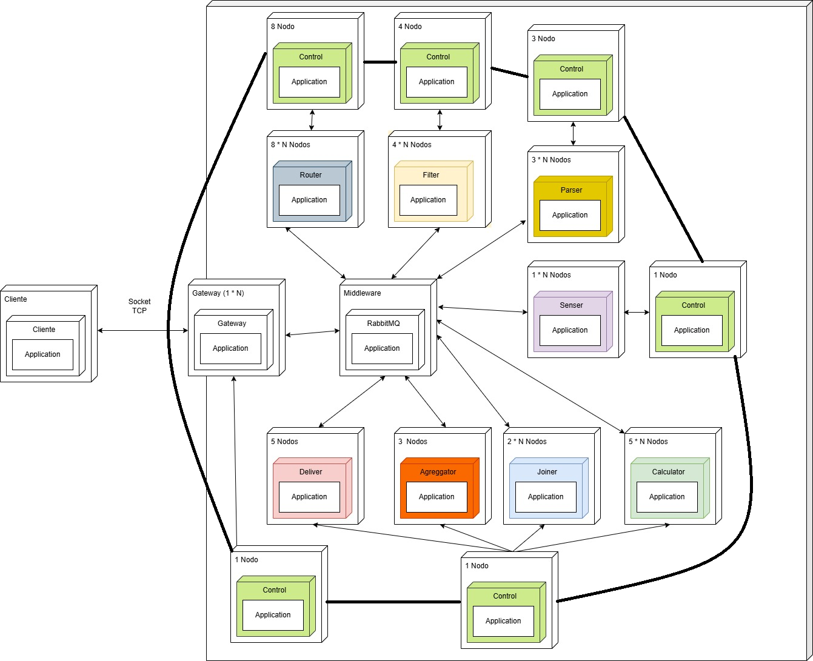

### Sobre la elección de líder en el gateway

Decidimos utilizar la elección de líder en el gateway porque de esta forma nos cubrimos de una posible caída del nodo que escucha las conexiones de los clientes, ya que, en caso de que se caiga el gateway líder, el cual está en espera de conexiones entrantes de clientes, se va a disparar una elección de líder para que se ocupe de escuchar las nuevas conexiones entrantes.

#### Algoritmo de elección

La elección de líder se realiza siguiendo el algoritmo de anillo. El algoritmo de elección es tolerante a fallas ya que si se caen algunos nodos de todas formas se elige un líder entre los que estén disponibles.

Esto se logra forzando que cada nodo envíe su mensaje a otro nodo vivo. Si el nodo "vecino" (el inmediatamente siguiente) está caído, entonces se comunica con el siguiente, y así sucesivamente. Si hay un único nodo vivo, entonces se termina comunicando consigo mismo y determina que él es el líder.

El nodo líder manda mensajes `PING` a las réplicas para informarles que sigue vivo. Las réplicas esperan estos mensajes periódicamente. Si luego de cierto tiempo no reciben `PING`, entonces asumen que el líder está muerto y se dispara una nueva elección de líder.

#### Sincronización entre `Gateway` y `LeaderElector`

La elección de líder ocurre en un thread diferente al del gateway, el cual ejecuta una instancia de `LeaderElector`.
Sin embargo, cada gateway necesita saber si él el líder. Es por esto que se utiliza un semáforo compartido entre el `Gateway` y el `LeaderElector`, para poder comunicarlos.

Cada vez que se elige un nuevo líder, el `LeaderElector` incrementa (`semaphore.release()`) el contador del semáforo. Por su parte, el `Gateway` está bloqueado esperando para decrementar (`semaphore.acquire()`) el contador del semáforo. Si `Gateway` se desbloquea del semáforo, entonces esto significa que se eligió un nuevo líder, por lo tanto `Gateway` chequea si él es el nuevo líder, y en ese caso se pone a escuchar por conexiones de clientes.

#### Contador de clientes en el gateway

Algo a tener en cuenta es que el gateway mantiene un contador de clientes, el cual se usa para asignarle IDs a los clientes. Es fundamental comunicar esta información con los gateway réplica, para que no se repitan los IDs de clientes ante una eventual caída del líder.
Para ello, cada vez que se conecta un nuevo cliente, el gateway líder broadcastea el contador de clientes al resto de gateways, y estos lo persisten en el disco.

Además, cuando una réplica se desconecta, al reconectarse le solicita el contador de clientes al líder. Esto es necesario porque puede darse el caso en el que se conecten nuevos clientes mientras una réplica está desconectada, en cuyo caso la réplica no recibiría las actualizaciones del contador de clientes, y por lo tanto tendría información desactualizada al reconectarse.

El siguiente diagrama ilustra un caso en el que el gateway 2 es inicialmente el líder, éste se cae y el gateway 1 asume como nuevo líder. Luego el gateway 2 se reconecta y le pregunta el `client_count` al líder. Al conectarse un nuevo cliente, el líder broadcastea el `client_count` actualizado.

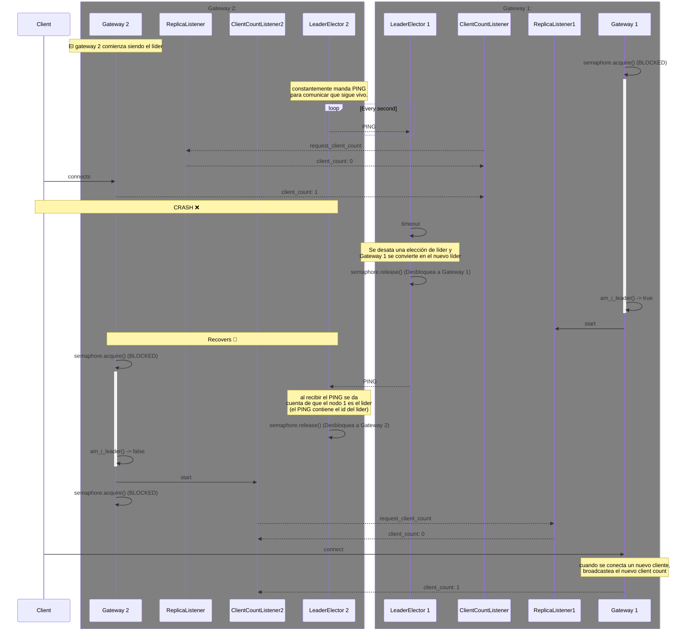
```mermaid
sequenceDiagram
    participant Client

    box Grey Gateway 2:
    participant Gateway 2
    participant ReplicaListener
    participant ClientCountListener2
    participant LeaderElector 2
    end

    Note over Gateway 2: El gateway 2 comienza siendo el líder
    

    box Grey Gateway 1:
    participant LeaderElector 1
    participant ClientCountListener
    participant ReplicaListener1
    participant Gateway 1
    end

    Gateway 1->>+Gateway 1: semaphore.acquire() (BLOCKED)
    Note over  LeaderElector 2: constantemente manda PING<br>para comunicar que sigue vivo.
    loop Every second
        LeaderElector 2-->>LeaderElector 1: PING
    end
    
    ClientCountListener-->>ReplicaListener: request_client_count
    ReplicaListener-->>ClientCountListener: client_count: 0
    

    Client->>Gateway 2: connects
    Gateway 2-->>ClientCountListener: client_count: 1

    Note over Client,LeaderElector 2: CRASH ❌
    
    LeaderElector 1->>LeaderElector 1: timeout
    Note over LeaderElector 1: Se desata una elección de líder y <br>Gateway 1 se convierte en el nuevo líder
    LeaderElector 1->>LeaderElector 1: semaphore.release() (Desbloquea a Gateway 1)
    Gateway 1->>-Gateway 1: am_i_leader() -> true
    
    Gateway 1->>ReplicaListener1: start
    Note over Gateway 2,LeaderElector 2: Recovers 🔄
    
    Gateway 2->>+Gateway 2: semaphore.acquire() (BLOCKED)
    LeaderElector 1-->>LeaderElector 2: PING
    Note over LeaderElector 2: al recibir el PING se da<br>cuenta de que el nodo 1 es el lider<br>(el PING contiene el id del lider)
    LeaderElector 2->>LeaderElector 2: semaphore.release() (Desbloquea a Gateway 2)
    Gateway 2->>-Gateway 2: am_i_leader() -> false
    Gateway 2->>ClientCountListener2: start
    Gateway 2->>+Gateway 2: semaphore.acquire() (BLOCKED)
    ClientCountListener2-->>ReplicaListener1: request_client_count
    ReplicaListener1-->>ClientCountListener2: client_count: 0
    Client->>Gateway 1: connect
    Note over Gateway 1: cuando se conecta un nuevo cliente,<br>broadcastea el nuevo client count
    Gateway 1-->>ClientCountListener2: client_count: 1
```
### Manejo de clientes desconectados o caídos

Cuando un cliente se desconecta del gateway, ya no podrá recibir respuestas. Para evitar mantener información innecesaria en el sistema, el gateway detecta esta desconexión y envía un mensaje `delete_client` que se propaga por todos los nodos del sistema. El objetivo es eliminar toda la información persistida asociada a ese cliente.

Dado que, por ejemplo, en el componente Join existen múltiples colas, el mensaje delete_client puede duplicarse y propagarse por más de un canal. Sin embargo, al llegar a los nodos Deliver, estos mensajes son filtrados: si el cliente ya fue eliminado, se descartan silenciosamente los mensajes duplicados. Cada nodo deliver (en total hay 5, uno por tipo de consulta) reenvía el mensaje delete_client hacia la cola líder correspondiente. Una vez que los cinco mensajes llegan, se considera que todos los tipos de consultas asociados al cliente han sido cerrados y se elimina la cola dedicada a ese cliente. Esto es un caso especial ya que la cola dedicada a ese cliente la suele borrar el gateway al terminar.

En caso de que el gateway se caiga inesperadamente, al reiniciarse se leen desde disco los IDs de los clientes que estaban conectados previamente. Luego, cualquier instancia de gateway —no solo la líder— envía mensajes delete_client hacia los nodos parser para limpiar cualquier estado residual que haya quedado del cliente caído.

### Cambios en la elección de líder del gateway

Uno de los problemas que tuvimos a la hora de implementar el algoritmo de elección de líder en anillo para los gateway fue la propagación de mensajes de elección después de haberse seleccionado un líder. Para resolverlo, decidimos que, una vez elegido, en caso de recibir el líder un nuevo mensaje de elección de líder, en lugar de reenviarlo, propague un mensaje indicando que él ya ha sido elegido como líder. Después de hacer este cambio no pudimos reproducir el error que se presentó a la hora de hacer la demostración grupal.
