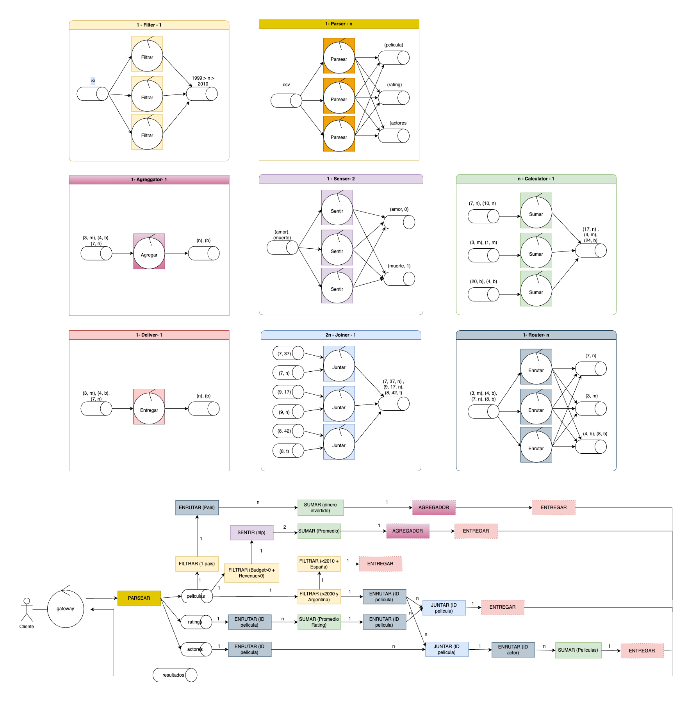
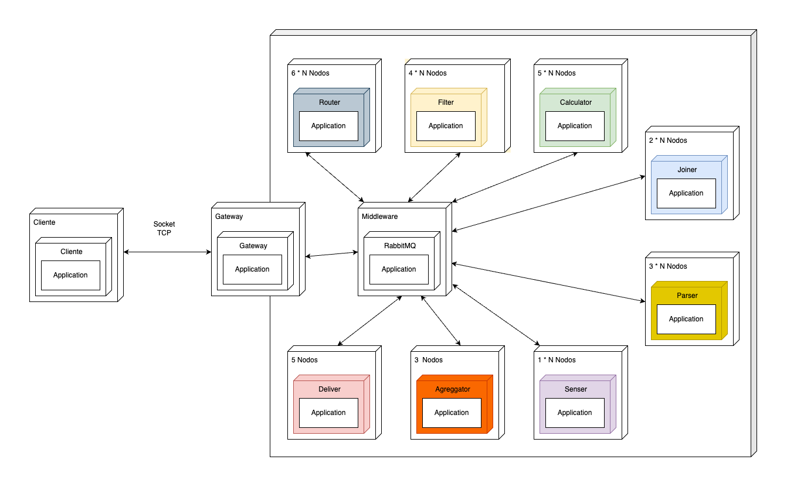

# Documentación de arquitectura

## Tabla de contenidos

1. [Vista física](#vista-física)
2. [Vista de desarrollo](#vista-de-desarrollo)
3. [Vista de procesos](#vista-de-procesos)
4. [Tareas a realizar](#tareas-a-realizar)

## Vista física

### Planteamiento

A partir de un análisis conjunto de todas las consultas (queries) que debíamos resolver, diseñamos un bosquejo que nos permitió visualizar el flujo de datos desde el ingreso del cliente hasta la obtención del resultado final. Identificamos funciones que se repetían en múltiples consultas —como el filtrado por año (> 2000), por país, o el enrutamiento por ID— y decidimos desacoplarlas como servicios independientes para reutilizarlas. Esto nos permitió no solo reducir el procesamiento redundante, sino también mejorar la eficiencia general del sistema al compartir resultados intermedios entre varias ramas de ejecución. A su vez, estructuramos la lógica de forma modular, de manera que cada función pudiera escalarse fácilmente y ser reutilizada en distintos contextos, manteniendo coherencia y simplicidad en el diseño.

### Diagrama de despliegue

El **diagrama de despliegue** muestra cómo están distribuidos los diferentes componentes del sistema sobre nodos físicos o virtuales. El sistema está diseñado con una arquitectura modular, distribuida y escalable, basada en microservicios.

### Flujo General

1. El cliente se conecta al gateway mediante un socket TCP, le envía los archivos y espera por las respuestas.
2. El gateway recibe los archivos del cliente, los envía a una queue y espera por las respuestas para luego enviárselas al cliente.
3. Los parsers leen de la queue del gateway, parsean y distribuyen los registros de los archivos, disparando el pipeline de procesamiento.
4. Una vez procesadas las consultas, los nodos deliver envian los resultados al gateway, quien luego se los envia al cliente.

### Diagrama de robustez

Este diagrama muestra el comportamiento interno del sistema, dividido por responsabilidades y relaciones entre componentes.

En este diagrama indicamos que hay más de una instancia de una entidad utilizando un asterisco (\*).

### Componentes Funcionales

#### Gateway

El gateway es el nodo encargado de:
1. Aceptar conexiones entrantes (TCP) de clientes.
2. Recibir los archivos que envía el cliente.
3. Enviar batches de los archivos a  a partir de la cual luego se distribuyen entre los distintos nodos.
4. Consumir las respuestas de las consultas a partir de una queue y enviárselas al cliente mediante la conexión TCP.

**Nota:** Los archivos son enviados a colas distintas (una cola por archivo).

#### Parser (escalable - 3 x N nodos)

El parser es el nodo encargado de:
1. Leer los batches de registros que envía el cliente.
2. Transformar/parsear dichos batches a un formato más sencillo de procesar.
3. Disponibilizar estos datos parseados para que los nodos puedan consumirlos.

El parser es agnóstico de cuáles y cuántos nodos consumen sus mensajes, simplemente los envía a un exchange de RabbitMQ con un `routing_key` que determina a qué archivo pertenece el batch.

Además de enviar los datos parseados, también envía mensajes para comunicar que no hay mas batches de un archivo en particular, y para comunicar que el cliente terminó de enviar todos los archivos.

#### Filter (escalable - 5 x N nodos)

El filter es el nodo encargado de filtrar aquellos registros que no forman parte de la respuesta a la query.
Puede leer registros de a uno a la vez como también de a batches, los cuales filtra según una condición que se puede definir mediante la configuración.

#### Router (escalable - 6 x N nodos)

El router se encarga de redireccionar registros de forma tal que los mismos puedan ser procesados de forma más eficiente.
Básicamente:
1. Consume registros de una queue.
2. Redirecciona cada registro a una queue específica según algun valor (en general un ID). Para determinar a qué queue corresponde el registro, se implementa una especie de sharding: el ID de la queue se determina realizando la cuenta `id_registro % cantidad_queues`. Esto nos garantiza que los registros con el mismo ID siempre van a la misma queue.

Esto nos permite realizar operaciones como el join distribuido entre dos tablas (lo cual no sería posible sin el router), o paralelizar cálculos como sumatorias o promedios de una columna dada, para un grupo de registros en particular (por lo general agrupado por ID).

Es importante destacar que el router debe conocer de antemano la cantidad de nodos que van a consumir sus mensajes (el cual es igual a la cantidad de queues).

#### Calculator (escalable - 3 x N nodos)

El calculator lee registros de una input queue, realiza una operacion sobre los registros (como sumatorias, promedios, etc), y envía el resultado a una output queue. Durante el procesamiento, el calculator va acumulando los resultados parciales del cálculo, y los entrega una vez que recibe el mensaje de finalización de archivo.

Para comunicar la finalización del cálculo distribuido a los siguientes nodos, se utiliza el mecanismo detallado en [Mecanismo de finalización](#mecanismo-de-finalización)

#### Joiner (escalable - 2 x N nodos)

El joiner se encarga de recibir registros de dos queues distintas, y juntar aquellos pares de registros que coincidan en alguna columna determinada.

En general los joiners trabajan con datos shardeados y consumen registros de dos queues (por ejemplo, una queue de películas y otra de actores).
Los joiners van consumiendo los registros de cada queue, y una vez que se terminan los registros (lo cual se comunica mediante un mensaje en cada queue), procede a juntarlos. Luego, los resultados finales de distintos joiners van a una misma queue.

Para comunicar la finalización del join distribuido a los siguientes nodos, se utiliza el mecanismo detallado en [Mecanismo de finalización](#mecanismo-de-finalización)

#### Sentiment Analyzer (escalable)

Este es el nodo encargado de leer películas de una input queue, analizar el sentimiento del `overview`, y redireccionar el resultado a una queue según el sentimiento de la película. Internamente utiliza los transformers de Hugging Face.

Al haber múltiples instancias de este nodo, todos consumen de la misma input queue, lo cual nos ahorra tener que sincronizar la finalización.

#### Aggregator (3 nodos)

El aggregator se encarga de consumir los resultados parciales de una consulta y agregarlos para obtener el resultado final.
Hay una única instancia de aggregator por cada consulta. Cada instancia va consumiendo los resultados parciales y los agrega (y envía el resultado final a la siguiente queue) una vez que recibe el mensaje de finalización.

#### Deliver (5 nodos)

El nodo deliver se encarga de leer los resultados del pipeline de procesamiento de cada consulta, ordenarlos, y obtener la respuesta final de la consulta, por ejemplo filtrando algunos registros o eliminando columnas que no forman parte de la respuesta.

Hay una instancia por cada consulta, las cuales deben sincronizarse entre sí para enviar el mensaje de finalización a la queue de respuestas, para que luego el gateway le comunique al cliente el fin de la consulta, según se indica en [Mecanismo de finalización](#mecanismo-de-finalización).

##### Mecanismo de finalización

Varios de los nodos (joiner, calculator) realizan un procesamiento distribuido y envían los resultados parciales a una queue.
Esto requiere cierta sincronización, para que el mensaje de finalización se envíe únicamente cuando todos los nodos entregaron su resultado (y no antes, ya que en ese caso se perdería parte del resultado). Para esto, los nodos comparten una queue de "finalización", de la cual se van desuscribiendo a medida que entregan los resultados parciales. Antes de desuscribirse, cada nodo se fija si es el último nodo suscrito a la queue, y en ese caso envía el mensaje de finalización. Para implementar este mecanismo, cada nodo levanta un thread exclusivo para esto.

**Nota:** en este caso la queue de finalización se usa como un contador de consumidores restantes (más que como queue).

En cuanto a la escalabilidad del ordenamiento de datos, en la primera query no se realiza ningún tipo de ordenamiento, ya que simplemente devolvemos todo lo que se filtra, lo cual no representa un desafío computacional. En la segunda query, el ordenamiento se realiza por país, pero dado que el número de países en el mundo es acotado (alrededor de 195) y no se espera un crecimiento exponencial, tampoco presenta un problema de escalabilidad.

En la tercera query, el nodo join va emitiendo los datos agrupados a medida que los empareja, por lo que el nodo deliver no recibe todos los datos de una sola vez. Solo necesita mantener el valor más alto y el más bajo, lo cual implica una complejidad baja.

Para la quinta query, el nodo aggregator devuelve únicamente dos valores: el promedio de sentimientos positivos y el promedio de negativos. A menos que la cantidad de tipos de sentimientos creciera de manera desproporcionada —lo cual es improbable—, este proceso no representa un cuello de botella en términos de ordenamiento ni de procesamiento.

El único caso que sí podría presentar problemas de escalabilidad es la cuarta query, donde se calcula un top 10 de actores. Si bien con los datasets actuales esto no genera inconvenientes, en un escenario con una gran cantidad de actores el proceso de ordenamiento podría transformarse en un cuello de botella, ya que actualmente no contamos con un nodo dedicado al ordenamiento.

Por razones de tiempo y contexto, decidimos no implementar un nodo específico de ordenamiento. Sin embargo, su desarrollo podría considerarse a futuro para mejorar la escalabilidad del sistema frente a datasets de mayor tamaño.

## Vista de desarrollo

### DAG

El diagrama muestra como se modifican los datos a lo largo de las consultas, y se puede ver con las columnas de las tablas con las que se van quedando los nodos a la hora de hacer las consultas.

Podemos ver que el filtro de películas posteriores se reutiliza para 3 consultas, en vez de repetirse su cálculo, y a medida que las consultas se van haciendo más específicas, se van requiriendo menos consultas para responderlas.

También podemos ver que para algunas consultas se usan más de una tabla, por lo que se tiene que hacer un join entre dichas tablas, que se ve representado por la operación Juntar, que en ambos casos se hace por el ID de la película.

En todos los casos la data se va transformando hasta llegar al resultado de la query, y todas se envían al data output, que termina de nuevo en el Gateway, que va a ser quien va a enviar las respuestas a las consultas.

#### Estructura General

- Existe una clase base abstracta llamada `Packet`, de la cual heredan todas las clases que representan diferentes tipos de información que circulan por el middleware (Nodo broker).
- El único paquetes que recibe el gateway es el `QueryPacket` como resultado de las querys por parte de alguna cola del middleware.

#### Tipos de Packet

- **`FinalPacket`**: Indica el fin de flujo de información dentro de una cola del sistema. Es especialmente útil en sistemas que utilizan colas y procesamiento asincrónico para saber cuándo detener el consumo.
- **`DataPacket`**: Clase intermedia que agrupa múltiples tipos de datos, funcionando como contenedor lógico de información que ya fue interpretada.
- **`QueryPacket`**: Se utiliza para enviar la respuesta final hacia el cliente, conteniendo los resultados solicitados.

#### Flujo de datos

1. El cliente se comunica mediante un socket con el `Gateway`.
2. El `Gateway`, que contiene al `Middleware`, recibe este paquete y lo interpreta, generando una instancia específica de una subclase de `Packet`.
3. Esa instancia se procesa internamente dentro del sistema, generando múltiples transformaciones, que a su vez van generando nuevos paquetes de tipo `DataPacket`.
4. Cada nodo al recibir `FinalPacket` sabe que ya no tiene mas trabajo por hacer y termina.

#### Ventajas del diseño

- **Extensibilidad**: Es sencillo agregar nuevos tipos de `Packet` sin modificar la lógica existente, respetando el principio de abierto/cerrado.
- **Claridad semántica**: Cada clase `Packet` tiene un propósito específico, lo que facilita el mantenimiento y la comprensión del sistema.

## Vista de procesos

### Diagrama de secuencia

Se eligió mostrar el diagrama de secuencia de la consulta 3, porque en dicha consulta se usan dos tablas, y se terminan uniendo los valores de las mismas.

Se puede ver que el archivo de películas pasa por los filtros correspondientes, y que se calcula el rating promedio para todas las películas, no solo para las que corresponden a los filtros aplicados en la tabla de películas. Esto es así porque consideramos mejor calcular promedios de películas que no vamos a usar que mandar todos los ratings en comunicación, priorizando la reducción de este último.

### Diagramas de actividades

#### Consulta 1

#### Consulta 2

#### Consulta 3

#### Consulta 4

Para resolver esta consulta planteamos una especie de "sharding" de registros, para poder realizar el JOIN de películas y actores de forma distribuida. Esto sucede en los enrutadores de actores y películas. Cada componente se encarga de "mandar" cada registro a su cola correspondiente.

Este "sharding" nos asegura que los actores y películas que comparten `id_pelicula` (la joining key) van a terminar guardados en la misma cola (en realidad son colas distintas pero tienen el mismo id).

Para implementar el sharding de registros en los enrutadores de películas y de actores, se podría hashear el `id_pelicula` de los registros, y calcular el módulo `hash(id_pelicula) % n` (siendo `n` la cantidad de nodos) para determinar el id de la cola en la cual hay que guardar los registros.

#### Consulta 5

## Tareas a realizar

A continuación se detallan las tareas a realizar para la implementación del sistema:

1. Definir e implementar el protocolo de comunicación. 
2. Implementar el cliente (serialización, envío de archivos, recepción de respuestas).
3. Implementar el gateway.
4. Implementar cada uno de los siguientes componentes:
    1. Parser
    2. Router
    3. Filter
    4. Calculator
    5. Joiner
    6. Sentiment analyzer
    7. Aggregator 
    8. Deliver
5. Implementar el middleware para la comunicación de grupos utilizando RabbitMQ.
6. Dockerizar cada uno de los componentes del sistema.
7. Implementar Docker compose con los componentes del sistema.
8. Implementar generador de Docker compose parametrizable. 
