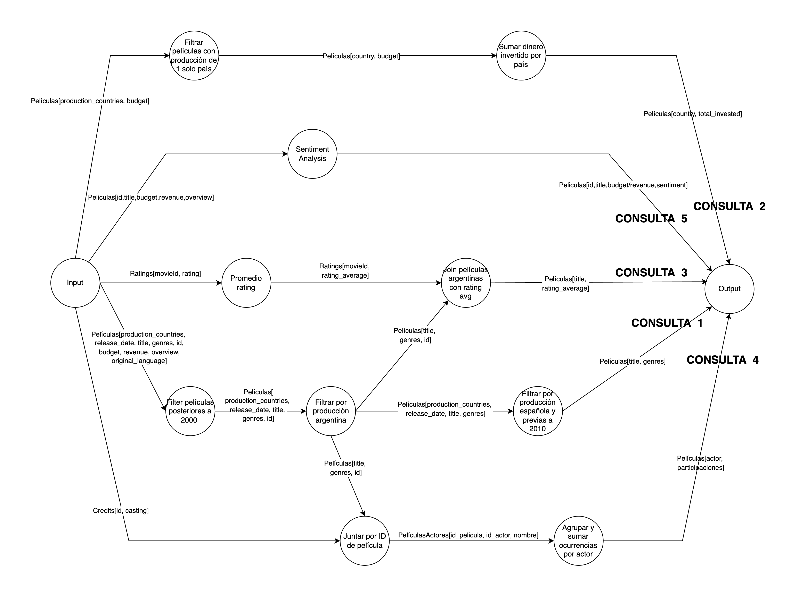
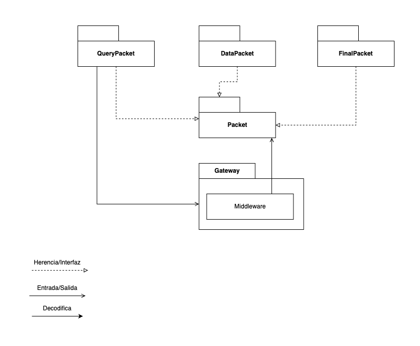

# Documentación de arquitectura

## Tabla de contenidos

1. [Vista física](#vista-física)
2. [Vista de desarrollo](#vista-de-desarrollo)
3. [Vista de procesos](#vista-de-procesos)
4. [Vista lógica](#vista-lógica)
5. [Tareas a realizar](#tareas-a-realizar)

## Vista física

### Planteamiento

A partir de un análisis conjunto de todas las consultas (queries) que debíamos resolver, diseñamos un bosquejo que nos permitió visualizar el flujo de datos desde el ingreso del cliente hasta la obtención del resultado final. Identificamos funciones que se repetían en múltiples consultas —como el filtrado por año (> 2000), por país, o el enrutamiento por ID— y decidimos desacoplarlas como servicios independientes para reutilizarlas. Esto nos permitió no solo reducir el procesamiento redundante, sino también mejorar la eficiencia general del sistema al compartir resultados intermedios entre varias ramas de ejecución. A su vez, estructuramos la lógica de forma modular, de manera que cada función pudiera escalarse fácilmente y ser reutilizada en distintos contextos, manteniendo coherencia y simplicidad en el diseño.

### Diagrama de despliegue

El **diagrama de despliegue** muestra cómo están distribuidos los diferentes componentes del sistema sobre nodos físicos o virtuales. El sistema está diseñado con una arquitectura **modular, distribuida y escalable**, basada en **microservicios**.

#### Flujo General

1. **Cliente**:

   - Se conecta mediante un **socket TCP** al sistema.
   - Envía archivos `.csv` con información de **libros**, **ratings** y **actores**.

2. **Gateway**:

   - Es el punto de entrada al sistema.
   - **Un gateway por cada cliente** en un escenario **multicliente**.
   - Recibe los archivos, los interpreta y los envía al Middleware.

3. **Middleware (RabbitMQ)**:

   - Funciona como **broker de mensajes**.
   - Encargado de distribuir los datos a los distintos componentes del sistema de forma asincrónica.

4. **Componentes del Sistema** (todos son **servicios desacoplados**):
   - **Parser (1 × N nodos)**: Procesa y transforma los datos de los `.csv`.
   - **Router (6 × N nodos)**: Enruta datos según claves específicas.
   - **Filter (5 × N nodos)**: Aplica filtros para mantener solo los paquetes que nos interesan.
   - **Calculator (3 × N nodos)**: Realiza cálculos como sumatorias o conteos.
   - **Joiner (2 × N nodos)**: Une datasets por claves compartidas (ej. ID película).
   - **Sensor (1 × N nodos)**: Analiza sentimientos u otras características del texto utilizando herramientas de procesamiento de lenguaje natural.
   - **Averager (2 nodos)**: Calcula promedios de los sentimientos.
   - **Aggregator / Deliver (5 nodos)**: Junta los resultados finales para entregárselos al cliente.

#### Escalabilidad

- Los componentes con multiplicadores de **N** son **escalables horizontalmente**.
- **`N` representa la cantidad máxima de instancias que el sistema puede levantar** para cada tipo de servicio, según la carga o necesidad.
- Permite paralelizar el procesamiento y mejorar el rendimiento en contextos de alta concurrencia.

### Diagrama de robustez

Este diagrama muestra el **comportamiento interno del sistema**, dividido por responsabilidades y relaciones entre componentes.

En este diagrama indicamos que hay más de una instancia de una entidad utilizando un asterisco (\*).

#### Componentes Funcionales

**Escalables (\*)**:

- **Parser**: Parsea los CSV en datos procesables para los otros nodos.
- **Filter**: Filtra datos por condiciones descartando las que no cumplen.
- **Router**: Direcciona el flujo de datos según distintas claves.
- **Calculator**: Realiza sumatorias de valores, conteos de elementos entre otras cosas.
- **Joiner**: Relaciona diferentes fuentes de datos con una clave común (ID película, etc.).
- **Sensor**: Aplica análisis de sentimientos sobre texto.

**No-Escalables**:

- **Averager**: Aplica promedios a todo un flujo de información. No escala ya que para hacer un promedio tenes que crear una columna de conteo para despues juntar todos los promedios parciales, entonces preferimos que se haga el promedio total directo separando el promedio positivo del negativo en 2 nodos.
- **Aggregator**: Selecciona y ordena los datos finales ademas de agrupar resultados parciales y componer una respuesta completa si es necesario.

### Conclusiones

- La arquitectura está pensada para ser **altamente escalable y distribuida**.
- Se pueden levantar múltiples instancias de cada componente según la necesidad (**N escalable**).

## Vista de desarrollo

### DAG

El diagrama muestra como se modifican los datos a lo largo de las consultas, y se puede ver con las columnas de las tablas con las que se van quedando los nodos a la hora de hacer las consultas.

Podemos ver que el filtro de películas posteriores se reutiliza para 3 consultas, en vez de repetirse su cálculo, y a medida que las consultas se van haciendo más específicas, se van requiriendo menos consultas para responderlas.

También podemos ver que para algunas consultas se usan más de una tabla, por lo que se tiene que hacer un join entre dichas tablas, que se ve representado por la operación Juntar, que en ambos casos se hace por el ID de la película.

En todos los casos la data se va transformando hasta llegar al resultado de la query, y todas se envían al data output, que termina de nuevo en el Gateway, que va a ser quien va a enviar las respuestas a las consultas.

#### Estructura General

- Existe una clase base abstracta llamada `Packet`, de la cual heredan todas las clases que representan diferentes tipos de información que circulan por el middleware (Nodo broker).
- La clase `PacketFactory` se encarga de **decodificar** la información recibida y transformarla en una instancia específica de una subclase de `Packet`, dependiendo del tipo de contenido.
- Los unicos paquetes que recibe el gateway son `CsvPacket` por parte de la conexión con el cliente y `QueryPacket` como resultado de las querys por parte de alguna cola del middleware.

#### Tipos de Packet

- **`CsvPacket`**: Representa los paquetes que se envían a través del **socket** entre el cliente y el `Gateway`. Contienen datos en formato CSV que serán procesados por el sistema. No hereda de `Packet`.
- **`FinalPacket`**: Indica el **fin de flujo de información** dentro de una cola del sistema. Es especialmente útil en sistemas que utilizan colas y procesamiento asincrónico para saber cuándo detener el consumo.
- **`DataPacket`**: Clase intermedia que agrupa múltiples tipos de datos, funcionando como contenedor lógico de información que ya fue interpretada.
- **`MoviePacket` / `RatingPacket` / `ActorsPacket` / `CsvParserPacket` / `QueryPacket`**: Son especializaciones de `DataPacket`, que representan distintas partes del procesamiento y contenido de los datos. Cada uno cumple una función específica, como enviar películas, ratings, actores, resultados, etc.
- **`QueryPacket`**: Se utiliza para enviar la **respuesta final** hacia el cliente, conteniendo los resultados solicitados.

#### Flujo de datos

1. El cliente envía un `CsvPacket` mediante un socket hacia el `Gateway`.
2. El `Gateway`, que contiene al `Middleware`, recibe este paquete y lo pasa al `PacketFactory`.
3. El `PacketFactory` decodifica el contenido, generando una instancia específica de una subclase de `Packet`.
4. Esa instancia se procesa internamente dentro del sistema, generando múltiples transformaciones, que a su vez van generando nuevos paquetes.
5. Cada nodo al recibir `FinalPacket` sabe que ya no tiene mas trabajo por hacer y termina.

#### Ventajas del diseño

- **Desacoplamiento**: La lógica de decodificación está separada del resto del sistema gracias al uso del `PacketFactory`.
- **Extensibilidad**: Es sencillo agregar nuevos tipos de `Packet` sin modificar la lógica existente, respetando el principio de abierto/cerrado.
- **Claridad semántica**: Cada clase `Packet` tiene un propósito específico, lo que facilita el mantenimiento y la comprensión del sistema.

## Vista de procesos

### Diagrama de secuencia

### Diagramas de actividades

#### Consulta 1

#### Consulta 2

#### Consulta 3

#### Consulta 4

Para resolver esta consulta planteamos una especie de "sharding" de registros, para poder realizar el JOIN de películas y actores de forma distribuida. Esto sucede en los enrutadores de actores y películas. Cada componente se encarga de "mandar" cada registro a su cola correspondiente.

Este "sharding" nos asegura que los actores y películas que comparten `id_pelicula` (la joining key) van a terminar guardados en la misma cola (en realidad son colas distintas pero tienen el mismo id).

Para implementar el sharding de registros en los enrutadores de películas y de actores, se podría hashear el `id_pelicula` de los registros, y calcular el módulo `hash(id_pelicula) % n` (siendo `n` la cantidad de nodos) para determinar el id de la cola en la cual hay que guardar los registros.

#### Consulta 5

## Vista lógica

### Diagrama de clases

### Diagrama de estados

## Tareas a realizar

A continuación se detallan las tareas a realizar para la implementación del sistema:

1. Definir e implementar el protocolo de comunicación. 
2. Implementar el cliente (serialización, envío de archivos, recepción de respuestas).
3. Implementar el gateway.
4. Implementar cada uno de los siguientes componentes:
    1. Parser
    2. Router
    3. Filter
    4. Calculator
    5. Joiner
    6. Sensor
    7. Averager
    8. Aggregator 
5. Implementar el middleware para la comunicación de grupos utilizando RabbitMQ.
6. Dockerizar cada uno de los componentes del sistema.
7. Implementar Docker compose con los componentes del sistema. 
