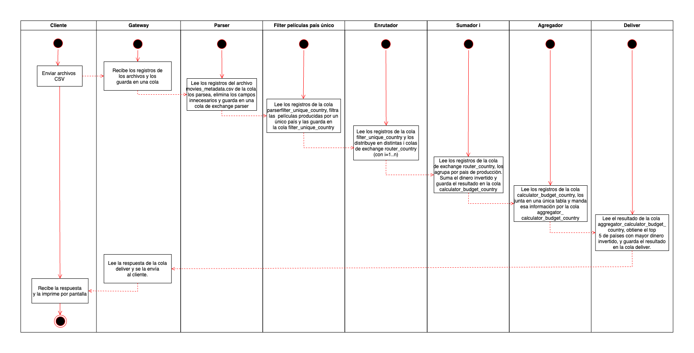

# Documentación de arquitectura

## Tabla de contenidos

1. [Vista lógica](#vista-lógica)
2. [Vista de desarrollo](#vista-de-desarrollo)
3. [Vista de procesos](#vista-de-procesos)
4. [Vista física](#vista-física)
5. [Tareas a realizar](#tareas-a-realizar)

## Vista lógica

### Diagrama de clases

### Diagrama de estados

## Vista de desarrollo

### Diagrama de componentes

### Diagrama de paquetes

## Vista de procesos

### Diagrama de secuencia

### Diagramas de actividades

#### Consulta 1

#### Consulta 2

#### Consulta 3

#### Consulta 4

Para resolver esta consulta planteamos una especie de "sharding" de registros, para poder realizar el JOIN de películas y actores de forma distribuida. Esto sucede en los enrutadores de actores y películas. Cada componente se encarga de "mandar" cada registro a su cola correspondiente.

Este "sharding" nos asegura que los actores y películas que comparten `id_pelicula` (la joining key) van a terminar guardados en la misma cola (en realidad son colas distintas pero tienen el mismo id).

Para implementar el sharding de registros en los enrutadores de películas y de actores, se podría hashear el `id_pelicula` de los registros, y calcular el módulo `hash(id_pelicula) % n` (siendo `n` la cantidad de nodos) para determinar el id de la cola en la cual hay que guardar los registros.

#### Consulta 5

## Vista física

### Diagrama de despliegue

### Diagrama de robustez

En este diagrama indicamos que hay más de una instancia de una entidad utilizando un asterisco (*).

## Tareas a realizar
