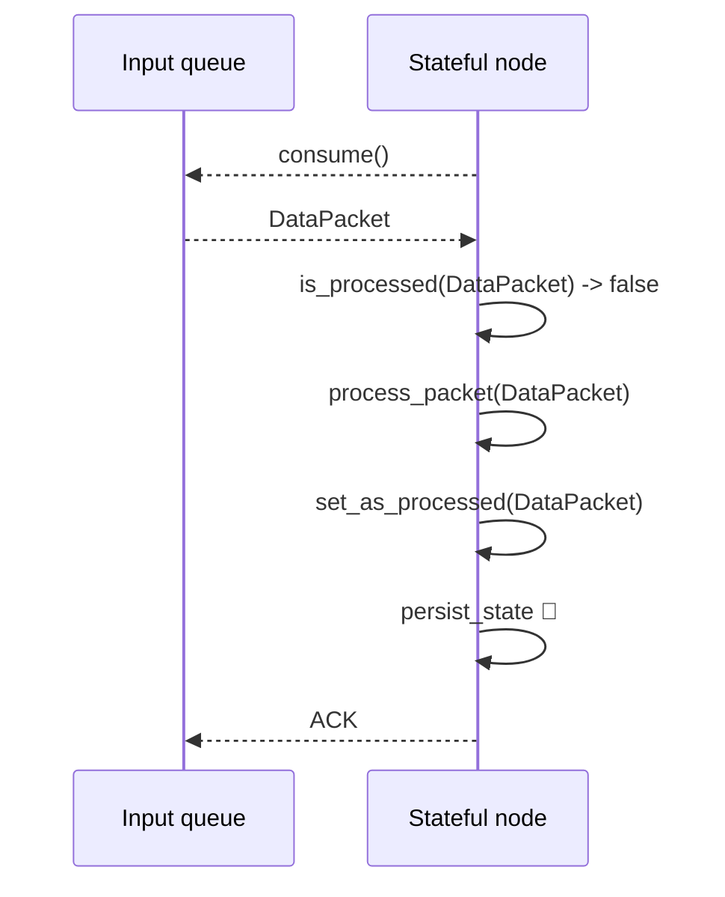
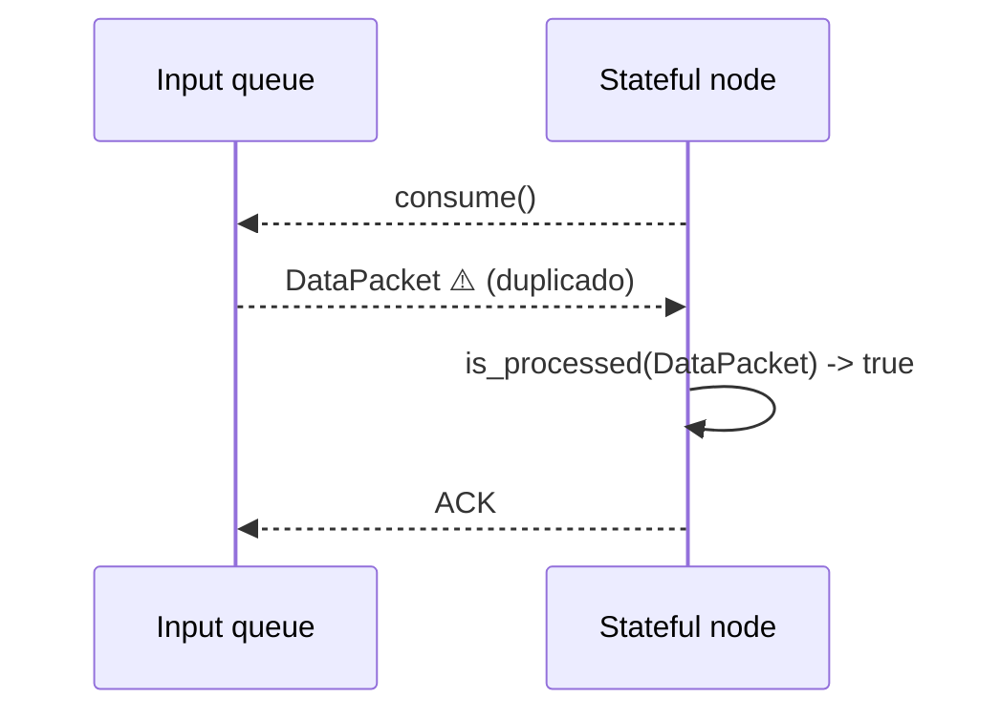
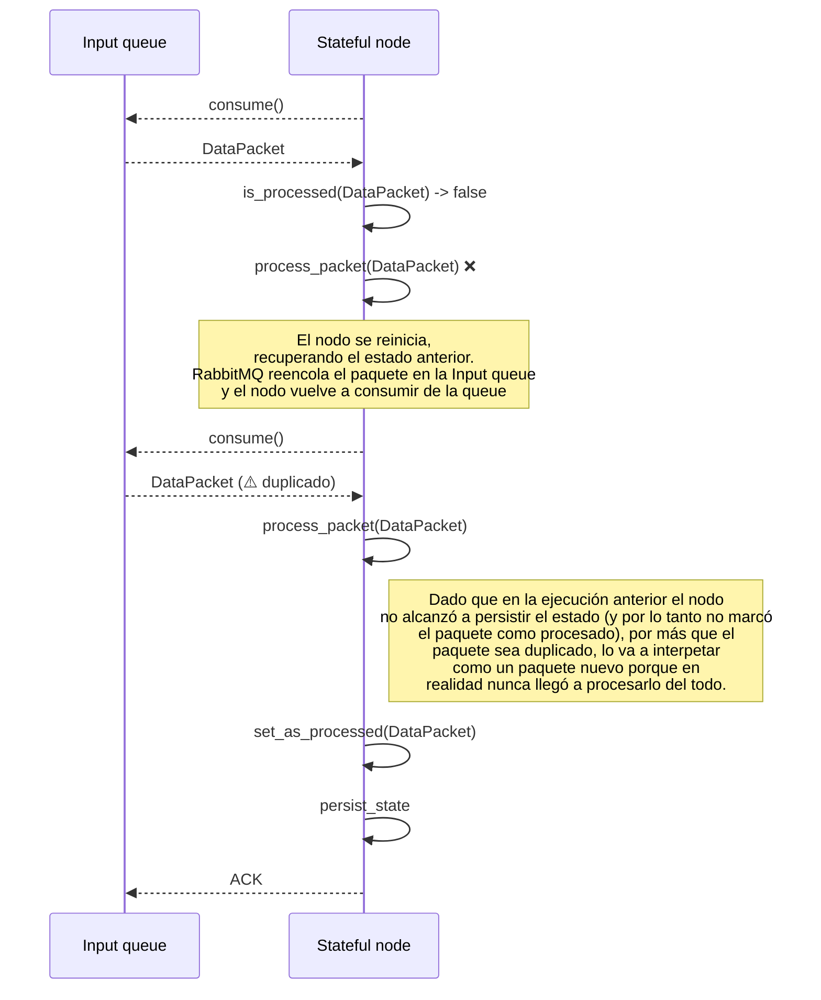
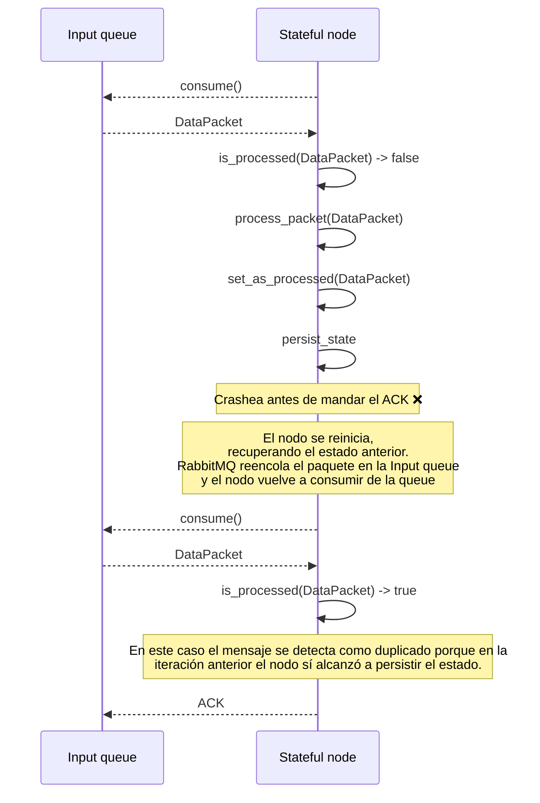
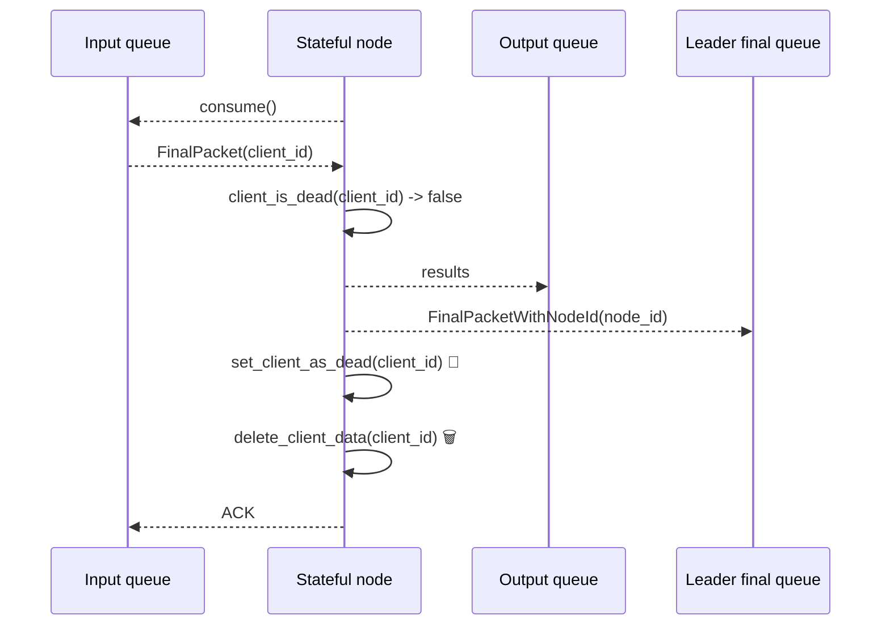
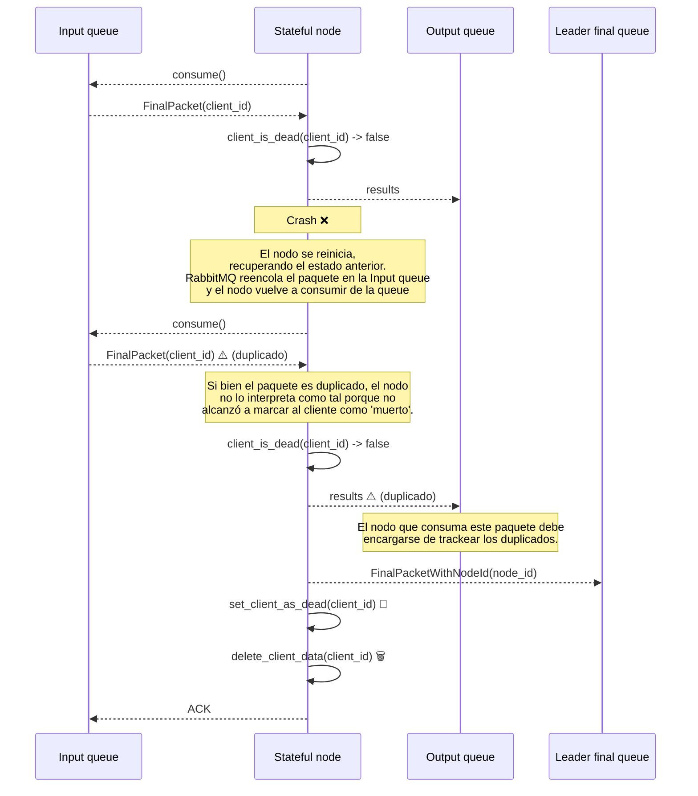

# Tolerancia a fallas en nodos stateful

A continuación se ilustran distintos casos de fallas en los nodos stateful (`calculator`, `aggregator`, `deliver`), y cómo se toleran en cada caso.

Estos nodos procesan `DataPackets` y `FinalPackets`. Cada vez que procesan un paquete, se modifica su estado. Al procesar un paquete, lo marcan como procesado para poder ignorarlo en caso de que el paquete sea duplicado.

## Flujo del procesamiento de `DataPacket`

A grandes rasgos, este es el happy-path cuando se procesa un `DataPacket` en los nodos stateful:



Si llega un paquete duplicado, el flujo sería el siguiente



### Casos de falla al procesar `DataPacket`

#### Caída antes de persistir el estado

El nodo puede fallar antes de alcanzar a persistir el estado (antes de empezar a guardarlo, o mientras lo esta guardando, en ese caso no guarda nada porque la escritura es atómica). En este caso, el nodo no alcanza a mandarle el ACK a RabbitMQ, por lo tanto el paquete se reencola. Cuando el nodo es reiniciado, vuelve a recibir el mismo paquete. Sin embargo, dado que el estado de la iteración anterior no se persistió, el nodo interpreta el mensaje como nuevo.



El mismo escenario se da si el nodo falla mientras modifica datos en memoria, ya sea procesando el mensaje, marcándolo como procesado, etc.

#### Caída luego de persistir el estado

El nodo también puede caerse inmediatamente después de haber persistido el estado.
En este caso, el nodo tampoco alcanza a mandar el ACK, por lo tanto el mensaje se reencola. Sin embargo, dado que el nodo sí alcanzó a persistir el estado en disco, ahora va a detectar el mensaje como duplicado y lo va a ignorar.



## Flujo del procesamiento de `FinalPacket`

A grandes rasgos, este es el happy-path cuando se procesa un `FinalPacket` en los nodos stateful:



### Casos de falla al procesar `FinalPacket`

#### Caída luego de enviar los resultados

Si el nodo se cae luego de reenviar los resultados, al levantarse los va a reenviar nuevamente. 
Pero esto no es un problema porque el nodo siguiente debe encargarse de detectar duplicados.
Dado que no se alcanzó a enviar el ACK, el paquete se va a reencolar y cuando el nodo se reinicie lo va a recibir nuevamente.
En este caso, por más que el paquete sea duplicado, no lo va a interpretar como tal porque no alcanzó a persistir el estado en la iteración anterior.



Si el nodo se cae luego de enviar el `FinalPacketWithNodeId`, en la siguiente iteración va a enviar repetido tanto los resultados como el `FinalPacketWithNodeId`, pero el nodo que consuma esos mensajes los va a detectar como duplicados.

#### Caída antes de eliminar los datos del cliente

Si el nodo se cae antes de eliminar los datos del cliente, pero luego de haberlo marcado como muerto, entonces al reiniciarse va a realizar una limpieza de los datos que hayan quedado, utilizando el módulo [dead_clients_tracker](../common/dead_clients_tracker.py).
Esto garantiza que la información de los clientes siempre se elimine por más que haya fallas.

```
sequenceDiagram
    participant Input queue
    participant Stateful node
    participant Output queue
    participant Leader final queue

    Stateful node-->>Input queue: consume()
    Input queue-->>Stateful node: FinalPacket(client_id)
    Stateful node->>Stateful node: client_is_dead(client_id) -> bool
    Stateful node-->>Output queue: results
    Stateful node-->>Leader final queue: FinalPacketWithNodeId(node_id)
    Stateful node->>Stateful node: set_client_as_dead(client_id) 💾
    Note over Stateful node: Crash ❌
    Note over Stateful node: El nodo se reinicia, <br>recuperando el estado anterior. <br>Dado que el cliente quedó marcado como "dead"<br>cuando el nodo se reinicie, va a realizar una limpieza<br>de aquellos archivos que hayan quedado de ejecuciones anteriores,<br><br><br>RabbitMQ reencola el paquete en la Input queue<br>y el nodo vuelve a consumir de la queue
    Stateful node-->>Input queue: consume()
    Input queue-->>Stateful node: FinalPacket(client_id) ⚠️ (duplicado)
    Stateful node->>Stateful node: client_is_dead(client_id) -> true
    Stateful node-->>Input queue: ACK
```

